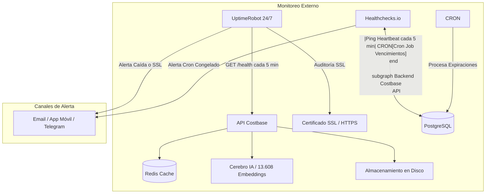

# Sistema de Monitoreo de Producción, Alertas SSL y Cron Jobs en Costbase

> **Última actualización:** Septiembre 2026  
> **Estado:** Implementado y Verificado  
> **Costo de infraestructura:** $0 USD/mes (Capas gratuitas de UptimeRobot y Healthchecks.io)

---

## 1. Visión General y Arquitectura de Observabilidad

Para garantizar alta disponibilidad en Costbase (Arko360) y prevenir incidentes silenciosos en producción, la plataforma cuenta con una arquitectura de observabilidad en tres niveles:



---

## 2. Endpoint Central de Salud: `/health`

El backend expone tres rutas idénticas para compatibilidad con balanceadores y monitores:
- `GET /health`
- `GET /api/v1/health`
- `GET /api/v1/system/health`

### ¿Qué audita en tiempo real?

1. **Base de Datos Primaria (PostgreSQL):** Ejecuta `SELECT 1` y mide la latencia de respuesta en milisegundos (`latency_ms`).
2. **Base de Datos Arko (PostgreSQL):** Verifica conectividad y latencia con la base de usuarios y planes.
3. **Caché Redis:** Verifica conectividad y respuesta a `ping()` para asegurar funcionamiento de códigos de registro y colas.
4. **Cerebro de IA (Embeddings en RAM):** Verifica si `SentenceTransformer` y la matriz de 13.608 embeddings están listos en memoria (`is_loaded = true`).
5. **Cron Job de Suscripciones:** Verifica si el loop asíncrono se ejecutó en los últimos 15 minutos, conteo de corridas, errores y resultados.
6. **Almacenamiento en Disco:** Monitorea espacio total, usado, disponible y porcentaje de ocupación, alertando preventivamente si supera el 85% o 95%.

### Códigos de Estado HTTP

- **HTTP 200 OK:**  
  El sistema está operativo (`healthy`) o con advertencia leve no bloqueante (`degraded`).
- **HTTP 503 Service Unavailable:**  
  Una o ambas bases de datos PostgreSQL están caídas. Este código es detectado automáticamente por herramientas de monitoreo externo para disparar alertas de emergencia.

### Ejemplo de Respuesta JSON

```json
{
  "status": "healthy",
  "timestamp": "2026-09-12T14:00:43.650486+00:00",
  "uptime_seconds": 3842.1,
  "environment": "production",
  "components": {
    "database_primary": {
      "status": "connected",
      "latency_ms": 0.66
    },
    "database_arko": {
      "status": "connected",
      "latency_ms": 0.77
    },
    "redis": {
      "status": "connected",
      "latency_ms": 0.42
    },
    "ai_engine": {
      "status": "ready",
      "is_loaded": true,
      "embeddings_count": 13608
    },
    "cron_subscription_expirations": {
      "status": "healthy",
      "last_run_at": "2026-09-12T13:58:12.120400+00:00",
      "minutes_since_last_run": 2.5,
      "total_runs": 48,
      "total_errors": 0,
      "last_error": null,
      "last_result": {
        "status": "ok",
        "expired_processed": 0,
        "warnings_sent": 1
      },
      "healthchecks_ping_enabled": true
    },
    "system_resources": {
      "disk": {
        "status": "healthy",
        "total_gb": 438.95,
        "used_gb": 264.87,
        "free_gb": 174.07,
        "percent_used": 60.3
      }
    }
  }
}
```

---

## 3. Monitoreo de Certificado SSL y Uptime 24/7 (UptimeRobot)

Los certificados SSL gratuitos de Let's Encrypt o Certbot tienen una validez de **90 días**. Si el proceso de auto-renovación falla silenciosamente (por puertos bloqueados, cambios en Nginx o límites de Cloudflare), los navegadores bloquearán el acceso a los usuarios con una pantalla roja de alerta de seguridad.

### Pasos de Configuración en UptimeRobot (Gratuito)

1. **Crear cuenta:** Regístrate gratis en [uptimerobot.com](https://uptimerobot.com) (el plan Free incluye hasta 50 monitores).
2. **Crear Monitor de la API:**
   - **Monitor Type:** `HTTP(s)`
   - **Friendly Name:** `Costbase Backend API`
   - **URL (or IP):** `https://api.gynsys.net/health` *(o la URL de tu API en producción)*
   - **Monitoring Interval:** `5 minutes`
3. **Activar Monitoreo de Certificado SSL:**
   - En la configuración del monitor o en la sección **SSL Settings**, activa la casilla **"Enable SSL Expiry Notification"**.
   - UptimeRobot auditará la cadena criptográfica y te enviará un aviso:
     - **30 días antes del vencimiento.**
     - **14 días antes del vencimiento.**
     - **7 días antes del vencimiento.**
4. **Configurar Contactos de Alerta:**
   - Puedes añadir tu correo electrónico, descargar la app móvil de UptimeRobot en tu teléfono (para recibir push notifications instantáneas) o enlazar un Bot de Telegram / Webhook de Discord.

---

## 4. Monitoreo del Cron Job con Heartbeat (Healthchecks.io)

Un cron job en segundo plano como `run_expiration_cron()` puede detenerse si el proceso de Python sufre un reinicio no controlado o se bloquea. Con un **Dead Man's Switch (Heartbeat)**, el cron "avisa que está vivo" periódicamente. Si no avisa dentro del tiempo esperado, el monitor externo envía una alarma.

### Pasos de Configuración en Healthchecks.io (Gratuito)

1. **Crear cuenta:** Regístrate gratis en [healthchecks.io](https://healthchecks.io) (el plan Free permite hasta 20 checks).
2. **Crear Check:**
   - **Name:** `Costbase - Expiración de Planes`
   - **Period (Intervalo):** `5 minutes` (coincide con el ciclo de 300 segundos de `run_expiration_cron`).
   - **Grace Time (Período de Gracia):** `10 minutes` (para evitar falsas alarmas por latencia de red).
3. **Obtener la URL de Ping:**
   - Copia la URL generada, por ejemplo:  
     `https://hc-ping.com/a1b2c3d4-e5f6-7890-abcd-ef0123456789`
4. **Configurar en el Servidor:**
   - Abre el archivo `.env` en el directorio de despliegue del backend:
     ```bash
     HEALTHCHECKS_PING_URL=https://hc-ping.com/a1b2c3d4-e5f6-7890-abcd-ef0123456789
     ```
   - Reinicia el backend:
     ```bash
     docker compose restart backend
     ```
5. **Comportamiento Automático:**
   - En cada ciclo exitoso (cada 5 minutos), el backend realiza una petición GET a la URL. Healthchecks lo marcará en verde (**OK**).
   - Si ocurre una excepción no controlada, el backend enviará inmediatamente un POST a `HEALTHCHECKS_PING_URL/fail` con el mensaje de error.
   - Si el servidor se apaga o el contenedor se congela, transcurridos los 15 minutos (5 min período + 10 min gracia), Healthchecks te alertará por Email o Telegram que el Cron está caído.

---

## 5. Umbrales Críticos del Servidor y Qué Hacer

### A. Almacenamiento en Disco (PostgreSQL Read-Only)

> [!CAUTION]
> Si el disco del servidor supera el **95% de uso**, PostgreSQL entra en modo de solo lectura (`read-only`), impidiendo que los usuarios guarden presupuestos, generen APUs o inicien sesión.

**Prevención:**
- Consultar `/health` para ver `percent_used`.
- Si el disco sube rápidamente, suele deberse a logs de Docker no truncados:
  ```bash
  # Limpiar imágenes huérfanas y contenedores detenidos
  docker system prune -a -f
  
  # Ver qué directorios ocupan más espacio
  du -sh /var/lib/docker/containers/* | sort -rh | head -n 5
  ```

### B. Memoria RAM y Motor de IA

- El modelo `paraphrase-multilingual-MiniLM-L12-v2` y los 13.608 embeddings ocupan aproximadamente **1.2 GB a 1.5 GB de memoria RAM**.
- Si el servidor físico tiene 4 GB de RAM o menos, asegúrate de configurar un archivo Swap de al menos 2 GB en Linux para evitar que el proceso sea terminado por el OOM Killer (*Out Of Memory*):
  ```bash
  # Crear swap de 2GB si no existe
  sudo fallocate -l 2G /swapfile
  sudo chmod 600 /swapfile
  sudo mkswap /swapfile
  sudo swapon /swapfile
  ```

### C. Conexiones a Base de Datos

- Costbase utiliza un pool de conexiones optimizado con cierre seguro en context manager (`with ArkoSessionLocal() as db:`).
- Si la latencia de la base de datos en `/health` supera los **100 ms**, revisa si hay bloqueos de transacciones abiertas en PostgreSQL:
  ```sql
  SELECT pid, now() - pg_stat_activity.query_start AS duration, query, state
  FROM pg_stat_activity
  WHERE (now() - pg_stat_activity.query_start) > interval '10 seconds'
    AND state != 'idle';
  ```
