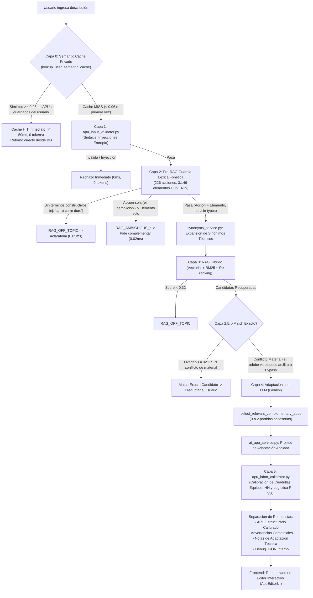

# Generador de APU con Inteligencia Artificial (Costbase / APUPro Platform)
## Guía Maestra de Arquitectura, Pipeline Multi-Capa y Manual de Mantenimiento

> **Módulo:** `costbase` / `cost360`  
> **Funcionalidad:** Generador de Análisis de Precios Unitarios (APU) con Inteligencia Artificial (Función Premium)  
> **Última Actualización:** Septiembre 2026  
> **Normativa de Referencia:** COVENIN 2000:1992 (Sector Construcción Venezuela)  
> **Base de Datos Oficial:** PostgreSQL (`cost360_items`) con **17.408 partidas** históricas y codificadas  

---

## Índice General de la Documentación
1. [Descripción General](#1-descripción-general)
2. [Mapa de Archivos del Sistema](#2-mapa-de-archivos-del-sistema)
3. [Flujograma General del Pipeline de 6 Capas](#3-flujograma-general-del-pipeline-de-6-capas)
4. [Capa 0: Caché Semántico Privado de APUs por Usuario (< 50ms, 0 Tokens)](#4-capa-0-caché-semántico-privado-de-apus-por-usuario--50ms-0-tokens)
5. [Capa 5: Calibrador Determinista de Cuadrillas, Equipos y Rendimiento (HH)](#5-capa-5-calibrador-determinista-de-cuadrillas-equipos-y-rendimiento-hh)
6. [Pipeline de Validación, Léxico y Adaptación LLM (Capas 1, 2, 2.5, 3 y 4)](#6-pipeline-de-validación-léxico-y-adaptación-llm-capas-1-2-25-3-y-4)
7. [Arquitectura Frontend y Editor Universal de APUs](#7-arquitectura-frontend-y-editor-universal-de-apus)
8. [Códigos Internos de Auditoría y Respuestas de la API](#8-códigos-internos-de-auditoría-y-respuestas-de-la-api)
9. [Manual Práctico de Mantenimiento y Batería de Pruebas](#9-manual-práctico-de-mantenimiento-y-batería-de-pruebas)

---

## 1. Descripción General

El **Generador de APU con IA** es la funcionalidad insignia de APUPro Platform (Costbase). Su objetivo es transformar una solicitud técnica en lenguaje natural (ej. *"Construcción de pared de bloques de arcilla e=15cm con mortero 1:4"* o *"Demolición de losa de concreto con acarreo de escombros"*) en un **Análisis de Precios Unitarios (APU) riguroso, balanceado y listo para presupuestar o licitar** en Venezuela.

A diferencia de generadores genéricos que "alucinan" cuadrillas o inventan precios y rendimientos irreales, APUPro opera bajo una arquitectura **Multi-Capa Defensiva de 6 Capas con RAG Híbrido, Adaptación Anclada y Calibración Determinista**:

0. **Capa 0: Caché Semántico Privado por Usuario (< 50ms, 0 Tokens):** Intercepta la consulta contra la base de datos privada del usuario (`cost360_custom_items`). Si existe un APU previamente guardado con similitud de coseno $\ge 0.96$, lo entrega al instante sin gastar tokens ni invocar al LLM.
1. **Defensa Temprana Fail-Fast (< 1ms, 0 Tokens):** Intercepta texto abusivo, inyecciones SQL/Prompt, entradas ambiguas (*"demolicion"*) o fuera de tema (*"carro corre duro"*, *"la moto corre mucho"*) **antes** de consumir cuotas o saturar la base de datos.
2. **Léxico COVENIN Oficial con Tolerancia Fonética:** Clasificador en memoria con **226 acciones** y **3.146 elementos/materiales** extraídos de las 17.408 partidas reales, capaz de reconocer variantes ortográficas venezolanas (*acareo*, *contruccion*, *excabacion*, *valdosas*).
3. **Guardia de Conflicto de Material en Match Exacto:** Si el texto coincide formalmente con una partida pero difiere en el material (ej. el usuario pide *"adobe"* y el catálogo tiene *"bloques huecos de arcilla"*), se bloquea el match exacto y se deriva al generador con IA.
4. **Anclaje de Rendimientos e Insumos Reales (RAG Híbrido):** Selecciona la partida histórica más afín y utiliza su estructura de costos (mano de obra, equipos, materiales) como base madre, fusionando complementarias solo si el alcance lo exige.
5. **Capa 5: Motor Determinista de Calibración de Cuadrillas, Equipos y HH (`apu_labor_calibrator.py`):** Calibra matemáticamente las cuadrillas, oficios, ayudantes, supervisión menor, logística inteligente de vehículos utilitarios (F-350 / Pick-up a 0.25 día), degradación de maquinaria pesada, herramientas y horas-hombre basadas en las 17.408 partidas de la base oficial.

---

## 2. Mapa de Archivos del Sistema

```
apupro_platform/
├── backend/
│   ├── app/
│   │   ├── api/v1/endpoints/
│   │   │   └── costbase.py                 # Endpoint principal /generate-ai-apu, Capa 0 y orquestación
│   │   ├── services/
│   │   │   ├── user_semantic_cache.py       # Capa 0: Caché semántico privado, embeddings y similitud
│   │   │   ├── apu_input_validator.py       # Capas 1 y 2: Sanitización, Guardia Léxica y Fonética
│   │   │   ├── synonyms_service.py          # Normalización de modismos y siglas técnicas
│   │   │   ├── ai_search.py                 # Motor RAG: Embeddings, BM25 y Re-ranking
│   │   │   ├── ai_apu_service.py            # Capa 4: Prompting LLM, adaptación y podado
│   │   │   ├── apu_labor_calibrator.py      # Capa 5: Calibrador determinista de cuadrillas, equipos y HH
│   │   │   ├── llm_router.py                # Abstracción multi-proveedor (Gemini, OpenAI, etc.)
│   │   │   └── data/
│   │   │       └── construction_lexicon.json # Léxico oficial (226 acciones, 3.146 elementos)
│   │   └── evaluations/
│   │       ├── golden_dataset_input_validation.py # 56 casos de prueba etiquetados
│   │       └── run_input_validation_tests.py      # Runner de validación por capas
│   ├── tests/
│   │   ├── test_labor_calibrator.py         # Suite de 15 pruebas unitarias de calibración y logística
│   │   └── test_user_semantic_cache.py      # Suite de 12 pruebas de similitud, HIT/MISS y privacidad
│   ├── scripts/
│   │   └── compile_construction_lexicon.py  # Compilador de léxico desde PostgreSQL
│   └── smoke_test_validator.py              # Suite de 34 tests unitarios de validación y typos
│
└── frontend/src/
    ├── components/
    │   ├── ApuEditorUI.jsx                  # Editor de APU completo con cálculo reactivo y modales
    │   ├── ComponentSelectorModal.jsx       # Modal de selección de materiales, equipos y mano de obra
    │   └── ComponentSearchModal.jsx         # Modal de búsqueda para presupuestos
    └── modules/costbase/
        ├── pages/
        │   ├── AIApuGeneratorPage.jsx       # Vista orquestadora modular con IA y Asistente Guiado
        │   └── APUViewer.jsx                # Visor y editor de APUs de bases certificadas y personalizadas
        ├── hooks/
        │   ├── useApuGenerator.js           # Hook: Llamadas API, estados, toast semántico y debug
        │   └── useGuidedAssistant.js        # Hook: Estado del Asistente Guiado (5 pasos)
        ├── constants/
        │   └── guidedBuilderConstants.js    # Opciones, chips y prompts de las 5 fases
        └── components/ai-generator/
            ├── ApuGeneratorHeader.jsx       # Encabezado contextual y tabs de modo
            ├── ClarificationAlertCard.jsx   # Tarjeta ámbar sin opciones adivinadas
            ├── ExactMatchCard.jsx           # Tarjeta interactiva de match exacto
            ├── GuidedAssistantModal.jsx     # Modal del Asistente Guiado paso a paso
            ├── FreeTextPromptInput.jsx      # Input de texto libre y botón Generar APU
            ├── SmartFilterCard.jsx          # Tarjeta de preguntas discriminantes
            ├── ImportFromDbPanel.jsx        # Panel de clonación de bases de datos
            └── DatabasePreviewList.jsx      # Visor colapsable de partidas históricas
```

---

---

## 3. Flujograma General del Pipeline de 6 Capas

El pipeline de procesamiento se ejecuta en 6 capas defensivas estrictamente ordenadas:



---

## 4. Capa 0: Caché Semántico Privado de APUs por Usuario (< 50ms, 0 Tokens)

* **Propósito Central:** Si un usuario pide una partida idéntica o con $\ge 96\%$ de similitud semántica a una que ya validó y guardó previamente en su presupuesto, el sistema **no vuelve a llamar al LLM ni consume tokens**. Responde en **menos de 50 milisegundos**.
* **Tiempo de Respuesta:** `< 50 ms` | **Costo:** `0 tokens de LLM` | **Aislamiento:** `Multi-tenant Estricto (Zero-Leak)`.
* **Detonador de Aprendizaje (Trigger):** Al presionar *"Guardar APU Generado"* (`POST /api/v1/cost360/custom-apus`), la función `save_custom_apu` vectoriza automáticamente la descripción con `ai_engine.encode_query` y almacena el vector embedding JSON en `cost360_custom_items.embedding`.
* **Mecanismo Matemático de Intercepción:**
  1. En `/generate-ai-apu`, **antes** de evaluar el RAG o llamar a Gemini, el backend consulta únicamente las partidas de `cost360_custom_items` donde `user_id == current_user.id`.
  2. Calcula la similitud de coseno en NumPy:
     $$\text{Similitud}(u, v) = \frac{u \cdot v}{\|u\| \|v\|}$$
  3. Si la similitud con un APU ya aprobado por este usuario es $\ge \mathbf{0.96}$, se reconstruye el APU directamente desde el JSON con `source: "user_semantic_cache"` y se devuelve de inmediato.
* **Aislamiento Estricto de Privacidad:** Se descartaron cachés comunitarios o globales públicos. Las partidas guardadas de un usuario pertenecen única y exclusivamente a su cuenta; ningún otro usuario puede consultar ni indexar sus APUs.
* **Experiencia de Usuario en Frontend:** Al recibir un APU desde la Capa 0, el frontend emite una notificación reactiva:
  `⚡ APU recuperado de tus partidas guardadas (X% similitud)`.
* **Tolerancia y Auto-Reparación de Base de Datos:** `backend/app/main.py` y `save_custom_apu` ejecutan auto-migración y auto-reparación preventiva (`ALTER TABLE cost360_custom_items ADD COLUMN IF NOT EXISTS embedding TEXT;`) junto con fallback SQL para garantizar cero caídas (500).

---

## 5. Capa 5: Calibrador Determinista de Cuadrillas, Equipos y Rendimiento (HH)

* **Archivo del Motor:** [`backend/app/services/apu_labor_calibrator.py`](file:///c:/Users/pablo/Documents/apupro_platform/backend/app/services/apu_labor_calibrator.py)
* **Propósito:** Corregir matemáticamente cualquier desbalance, oficio incompatible, sobrecosto o alucinación de cuadrillas y rendimientos físicos generados por el LLM antes de mostrar el APU al usuario.

### 5.1 Estudio Empírico de la Base de Datos Oficial (17.408 Partidas)
El motor de calibración se diseñó mediante un estudio exhaustivo de la base de datos oficial COVENIN, contrastando especialmente:
1. **1.422 Partidas R (Reparaciones, Reformas y Remociones):**
   - **Comportamiento en `und` / `pza`:** Se comprobó que el 90% de las partidas de reparación puntual de elementos tienen un rendimiento real de **$1.0\text{ a }1.5\text{ und/día}$** (mediana = 1.00), desmintiendo los 12.0 und/día que alucinaba el LLM.
   - **Logística de Vehículos Utilitarios:** El segundo equipo más recurrente en reparaciones es el `CAMION FORD F- 350 ESTACAS` (110 partidas) y `CAMIONETA PICK-UP` (43 partidas), con una asignación estándar de **$0.25\text{ a }0.50\text{ día}$**, acompañado por su respectivo `CHOFER` (152 partidas).
2. **1.483 Partidas M (Mantenimiento, Montaje y Mecánica):**
   - Evidenció la necesidad de desacoplar maquinaria pesada (volquetes 750, grúas pesadas, chutos) heredadas de obras viales de gran escala cuando la intervención es en sitio o en altura.

### 5.2 Reglas Deterministas de Calibración
1. **Preservación del Vehículo Utilitario de Apoyo Logístico:**
   - Para cuadrillas de mantenimiento, herrería y reparaciones en sitio, el vehículo utilitario (`CAMION FORD F-350 ESTACAS` o `CAMIONETA PICK-UP`) **NO se elimina**.
   - Se preserva y acota a una escala representativa de **$0.25\text{ día}$**, reconociendo el costo del traslado logístico de la cuadrilla y herramientas hasta la obra.
2. **Degradación Inteligente de Maquinaria Pesada:**
   - Si la partida base del RAG o el LLM introdujo camiones 750, gandolas, chutos, volquetes pesados o grúas industriales fuera de escala para una reparación en sitio, el sistema los degrada automáticamente a **Camión F-350 a $0.25\text{ día}$**.
3. **Sincronización Automática del Chofer:**
   - Todo vehículo de apoyo en la sección de equipos garantiza la presencia de su correspondiente **`CHOFER` a $0.25\text{ día}$** en la mano de obra.
4. **Proporcionalidad y Sustitución de Oficios Incompatibles:**
   - Si para una estructura metálica la base heredó `ALBAÑIL` o `CABILLERO`, se convierten automáticamente en **`HERRERO DE 1RA`** o **`SOLDADOR DE 1RA`**.
5. **Control de Supervisión Menor:**
   - Detecta cargos de maestros de obra (`MAESTRO CABILLERO`, `MO-DIR`) y los normaliza como supervisión menor (`CAPORAL` $\le 0.25\text{ día}$) para que no inflen la cuadrilla operativa.
6. **Racionalización de Ayudantes:**
   - En reparaciones y refuerzos en sitio, la mano de obra no calificada se acota a **máximo 1.0 ayudante por especialista**.
7. **Sincronización de Herramientas Metalmecánicas:**
   - 1 máquina soldadora por soldador activo y esmeril angular para corte y desbaste.
8. **Anclaje Matemático de Rendimiento por Horas-Hombre (HH):**
   $$\text{Rendimiento Calibrado} = \frac{\text{Total Personas Cuadrilla} \times 8.0\text{ horas}}{\text{HH Empírica de Referencia}}$$
   - `ESTRUCTURAS_METALICAS_und`: 24.0 HH/und $\rightarrow$ **$1.0 - 1.5\text{ und/día}$** para cuadrilla típica de 3 personas.
   - `ESTRUCTURAS_METALICAS_kgf`: 0.038 HH/kgf $\rightarrow$ **$630\text{ kgf/día}$**.
   - `REPARACIONES_PUNTUALES_pza`: 2.4 HH/pza $\rightarrow$ **$8.0\text{ pza/día}$**.
   - `REPARACIONES_PUNTUALES_und`: 16.0 HH/und $\rightarrow$ **$1.0\text{ und/día}$**.

---

## 6. Pipeline de Validación, Léxico y Adaptación LLM (Capas 1, 2, 2.5, 3 y 4)

### Fase 1: Capa 1 — Sanitización Sintáctica y Seguridad (`apu_input_validator.py`)
* **Tiempo:** `< 1 ms` | **Costo:** `0 tokens` | **Red:** `Ninguna`
* **Verificaciones:** Longitud (10-500 caracteres), Inyecciones SQL/HTML/Prompt, Entropía de Shannon ($\ge 2.5$), relación de vocales (20-75%).

### Fase 2: Capa 2 — Guardia Léxica Pre-RAG y Tolerancia Fonética
* **Léxico Oficial COVENIN (`construction_lexicon.json`):** 226 acciones constructivas y 3.146 elementos físicos y materiales.
* **Tolerancia Fonética O(1) (`_spanish_ortho_normalize`):** Betacismo (`v`/`b`), seseo (`c`/`s`/`z`), omisión de `s` preconsonántica (*contruccion*), geminadas reducidas (*acareo*).
* **Guardia Anti-Falsos Positivos:** Palabras cotidianas no constructivas (*carro*, *moto*, *pizza*) nunca pasan como términos técnicos.

### Fase 3: Capa 2.5 — Detección de Match Exacto y Guardia de Conflicto de Material
* Match exacto ($\ge 92\%$) con partida de catálogo **únicamente si no hay conflicto técnico de material** (ej. si el usuario pide *adobe* y el catálogo tiene *bloques de arcilla*, se bloquea el match exacto y se deriva al generador con IA).

### Fase 4: Capa 3 — Búsqueda RAG Híbrida y Complementarias
* Expansión de sinónimos técnicos (`synonyms_service.py`), búsqueda semántica y auto-fusión de hasta 2 partidas accesorias solo si el alcance no es autosuficiente.

### Fase 5: Capa 4 — Adaptación Anclada con LLM (`ai_apu_service.py`)
* Prompting técnico anclado: precios unitarios intocables, código SC de partida especial, anclaje de rendimientos oficiales y supresión de opciones adivinadas en clarificación (`options: []`).

---

## 7. Arquitectura Frontend y Editor Universal de APUs

El frontend de generación y edición de APUs está organizado bajo principios de Clean Architecture y Responsabilidad Única (SRP):

### 4.1 Custom Hooks de Negocio
* **[`useApuGenerator.js`](file:///c:/Users/pablo/Documents/apupro_platform/frontend/src/modules/costbase/hooks/useApuGenerator.js):**
  * Gestiona las peticiones a la API (`generateAIApu`).
  * Controla estados de carga por fases (*Analizando semántica*, *Buscando en base COVENIN*, *Adaptando APU*).
  * Maneja respuestas de aclaratoria (`clarification_needed`) y match exacto (`exact_match_candidate`).
  * **Detección de Caché Semántico:** Identifica `response.source === 'user_semantic_cache'` y emite un toast reactivo instantáneo: `⚡ APU recuperado de tus partidas guardadas (X% similitud)`.
  * Administra la descarga automática del archivo de diagnóstico JSON (`debug_apu_*.json`) enriquecido con el listado completo de insumos de materiales, equipos y mano de obra.
* **[`useGuidedAssistant.js`](file:///c:/Users/pablo/Documents/apupro_platform/frontend/src/modules/costbase/hooks/useGuidedAssistant.js):**
  * Controla el asistente conversacional interactivo (Fases 0 a 5).
  * Concatena dinámicamente las respuestas del usuario en un prompt estructurado: `[Acción] + [Elemento] + [Material] + [Alcance]`.

### 4.2 Componentes UI Especializados
* **[`ApuEditorUI.jsx`](file:///c:/Users/pablo/Documents/apupro_platform/frontend/src/components/ApuEditorUI.jsx):**
  * Editor tabular interactivo universal para APUs generados, certificados y de presupuestos.
  * Realiza el cálculo reactivo en tiempo real de costos directos (materiales, equipos con factor de depreciación, mano de obra con FCAS e incidencias) y costos indirectos (administración, utilidad, IVA).
  * **Sincronización de Equipos y Depreciación:** Al hacer clic en la lupa de fila o en el botón general de búsqueda, propaga tanto el precio unitario de adquisición como el factor de depreciación diario (`depreciacion`), evitando que la fila conserve valores estáticos de `1.0`.
* **[`ComponentSelectorModal.jsx`](file:///c:/Users/pablo/Documents/apupro_platform/frontend/src/components/ComponentSelectorModal.jsx):**
  * Modal de exploración y selección de insumos desde las bases de datos (materiales, equipos y mano de obra).
  * Mapea robustamente el factor `deprec_factor`, infiriendo `CosDia / precio` cuando el registro histórico no lo tenga explícito.
* **[`ClarificationAlertCard.jsx`](file:///c:/Users/pablo/Documents/apupro_platform/frontend/src/modules/costbase/components/ai-generator/ClarificationAlertCard.jsx):**
  * Tarjeta ámbar limpia sin botones de alternativas adivinadas.
  * Presenta la guía de **REDACCIÓN RECOMENDADA** y las preguntas clave.
  * Muestra los botones de acción: `[Usar Asistente Guiado Paso a Paso]` y `[Reiniciar Entrada Libre]` / `[Reiniciar Chatbot]`.
* **[`FreeTextPromptInput.jsx`](file:///c:/Users/pablo/Documents/apupro_platform/frontend/src/modules/costbase/components/ai-generator/FreeTextPromptInput.jsx):**
  * Textarea con auto-ajuste de altura y conmutador entre modo Asistente y Entrada Libre.
  * **Ocultación Reactiva:** Si la entrada está en estado de aclaratoria por ser demasiado breve, oculta el botón "Generar APU" y el campo para obligar a reiniciar o usar el Asistente Guiado.
* **[`ExactMatchCard.jsx`](file:///c:/Users/pablo/Documents/apupro_platform/frontend/src/modules/costbase/components/ai-generator/ExactMatchCard.jsx):**
  * Permite adoptar con un solo clic una partida existente en base de datos sin gastar cuota mensual de IA.

---

## 8. Códigos Internos de Auditoría y Respuestas de la API

La API `/generate-ai-apu` devuelve una estructura JSON estándar con códigos de diagnóstico para auditoría interna:

| Código Interno / Origen | Estado HTTP | Veredicto | Significado Técnico |
|---|:---:|:---:|---|
| `user_semantic_cache` | 200 | `completed` | **Cache HIT:** APU idéntico o semánticamente equivalente ($\ge 0.96$) recuperado de la base privada del usuario en <50ms (0 tokens). |
| `SQL_INJECTION` | 200 | `reject` | Intento de inyección SQL interceptado en Capa 1. |
| `PROMPT_INJECTION` | 200 | `reject` | Intento de manipulación de instrucciones LLM en Capa 1. |
| `HTML_INJECTION` | 200 | `reject` | Inyección de etiquetas HTML o scripts en Capa 1. |
| `LOW_ENTROPY` | 200 | `reject` | Texto repetitivo o monótono en Capa 1 (*"demolicion demolicion..."*). |
| `RAG_OFF_TOPIC` | 200 | `reject` / `clarification_needed` | Entrada sin términos constructivos (*"carro corre duro"*, *"pizza"*) o score RAG $< 0.32$. |
| `RAG_AMBIGUOUS_ACTION_ONLY` | 200 | `clarification_needed` | Entrada con verbo constructivo pero sin elemento físico (*"demolicion"*, *"instalacion"*). |
| `RAG_AMBIGUOUS_ELEMENT_ONLY` | 200 | `clarification_needed` | Entrada con elemento constructivo pero sin acción técnica (*"tuberia"*, *"valdosas"*). |
| `RAG_ACARREO_MISSING_UNIT` | 200 | `clarification_needed` | Entrada de acarreo/transporte sin unidad (`m3.m`, `m3`, `m3xkm`, `sac.m`, `vje`) ni distancia o método. |
| `RAG_NO_CANDIDATES` | 200 | `reject` | La búsqueda vectorial no arrojó ninguna partida afín en el catálogo. |
| `exact_match_candidate` | 200 | `exact_match_candidate` | Partida oficial de catálogo con coincidencia exacta de texto y material. |

### Formato de Respuesta en Aclaratoria
```json
{
  "status": "clarification_needed",
  "clarification_message": "La descripción es demasiado breve para generar un APU preciso. Por favor describe la actividad con al menos el elemento constructivo y la acción a ejecutar.",
  "recommendation": "Te recomendamos utilizar el Asistente Guiado para estructurar tu descripción paso a paso.",
  "options": [],
  "questions": [
    "1. Acción principal: ¿Qué actividad deseas presupuestar (demolición, construcción, instalación)?",
    "2. Elemento constructivo: ¿Sobre qué elemento se actúa (pared, tubería, losa, piso)?",
    "3. Material o especificación: ¿Qué material o resistencia tiene (bloque, PVC, concreto)?",
    "4. Método y alcance: ¿Se realiza a mano o con maquinaria? ¿Incluye bote o transporte?"
  ],
  "guia_redaccion": "Estructura recomendada: [Acción] + [Elemento] + [Material/Especificación] + [Método].",
  "_internal_code": "RAG_AMBIGUOUS_ACTION_ONLY"
}
```

---

## 9. Manual Práctico de Mantenimiento y Batería de Pruebas

### 6.1 ¿Cómo re-compilar el Léxico Constructivo tras agregar partidas a PostgreSQL?
Si se importan o modifican partidas en la tabla `cost360_items`, ejecuta el compilador oficial:
```bash
cd backend
python scripts/compile_construction_lexicon.py
```
Este script analiza las descripciones, extrae las acciones y elementos morfológicos y actualiza automáticamente `backend/app/services/data/construction_lexicon.json`.

### 6.2 ¿Cómo agregar nuevas reglas de Tolerancia Ortográfica Fonética?
Abre [`backend/app/services/apu_input_validator.py`](file:///c:/Users/pablo/Documents/apupro_platform/backend/app/services/apu_input_validator.py) y edita la función `_spanish_ortho_normalize(w: str)`:
```python
# Ejemplo: incorporar asimilación de 'll' a 'y'
w = w.replace("ll", "y")
```
Al reiniciar el servidor, `_ACTION_ORTHO_MAP` y `_ELEMENT_ORTHO_MAP` se pre-computan automáticamente con la nueva regla.

### 6.3 ¿Cómo agregar un nuevo Modismo o Término Técnico?
Abre [`backend/app/services/synonyms_service.py`](file:///c:/Users/pablo/Documents/apupro_platform/backend/app/services/synonyms_service.py) y agrega la tupla en `TECHNICAL_SYNONYMS`:
```python
(r"\b(NUEVO_TERMINO|VARIANTE)\b", "EQUIVALENTE_NORMATIVO_COVENIN"),
```

### 6.4 ¿Cómo ejecutar la Batería Completa de Pruebas Automatizadas?
1. **Calibrador de Mano de Obra, Equipos y Rendimientos (15 pruebas unitarias):**
   ```bash
   cd backend
   python -m unittest tests/test_labor_calibrator.py
   ```
2. **Caché Semántico Privado de Usuarios (12 pruebas unitarias de similitud, HIT/MISS y privacidad):**
   ```bash
   cd backend
   python -m unittest tests/test_user_semantic_cache.py
   ```
3. **Suite Completa de Pruebas Backend (27 pruebas en total):**
   ```bash
   cd backend
   python -m unittest discover -s tests -p "test_*.py"
   ```
4. **Smoke Tests de Entrada y Léxico (34 pruebas de seguridad y typos):**
   ```bash
   cd backend
   python smoke_test_validator.py
   ```
5. **Evaluación de Golden Dataset por Capas (56 casos etiquetados):**
   ```bash
   cd backend
   python -m app.evaluations.run_input_validation_tests --capa 2
   ```
6. **Verificación de Compilación Frontend:**
   ```bash
   cd frontend
   npm run build
   ```
