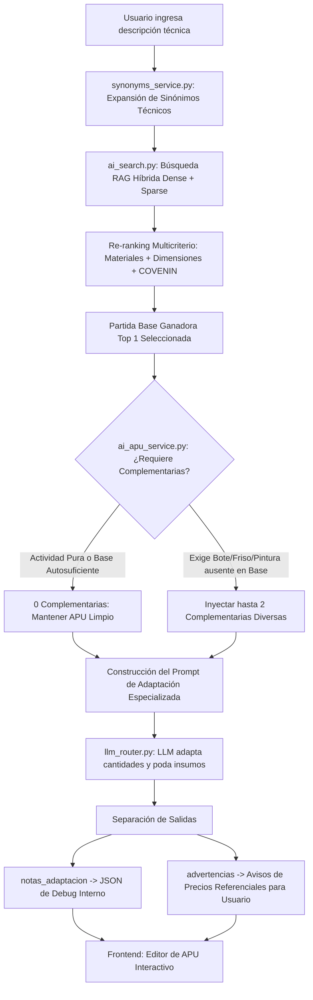

# Generador de APU con Inteligencia Artificial (Costbase / Cost360)
## Guía Maestra de Arquitectura, Flujo de Ejecución y Manual de Mantenimiento

> **Módulo:** `cost360`  
> **Funcionalidad:** Generador de Análisis de Precios Unitarios (APU) con Inteligencia Artificial (Función Premium)  
> **Última Actualización:** Septiembre 2026  
> **Normativa de Referencia:** COVENIN 2000:1992 (Sector Construcción Venezuela)  

---

## 1. Descripción General

El **Generador de APU con IA** es la funcionalidad insignia (*premium*) de Costbase. Su objetivo es transformar una solicitud técnica en lenguaje natural (ej. *"Construcción de pared de adobe e=15cm"* o *"Vaciado de losa maciza e=12cm con concreto 250 con bote a 10km"*) en un **Análisis de Precios Unitarios (APU) riguroso, balanceado y listo para licitar** en Venezuela.

A diferencia de sistemas genéricos basados en prompts simples que "alucinan" cuadrillas o inventan precios y rendimientos irreales, Costbase opera bajo una arquitectura **RAG Híbrida con Adaptación de Base Real**:
1. **Nunca inventa un APU desde cero**: Busca en una base de datos certificada de más de 13.600 partidas históricas para encontrar la partida constructiva más afín.
2. **Ancla rendimientos e insumos reales**: Toma la estructura comprobada (mano de obra, equipos y materiales de la partida ganadora) y la utiliza como base madre.
3. **Auto-fusión inteligente**: Inyecta partidas complementarias solo si el usuario pide actividades compuestas (ej: bote de escombros, friso, pintura), evitando contaminar partidas autosuficientes.
4. **Supervisión LLM acotada**: El Modelo de Lenguaje (LLM) no calcula precios ni inventa códigos; únicamente adapta cantidades, poda insumos sobrantes y formula la descripción técnica bajo la convención venezolana de Partidas Especiales (`SC`).

---

## 2. Mapa de Archivos del Sistema

A continuación se detalla la ubicación y responsabilidad de cada archivo involucrado:

### 2.1 Backend (Python / FastAPI)

| Archivo | Ruta | Responsabilidad Técnica |
|---|---|---|
| **Diccionario de Sinónimos** | `backend/app/services/synonyms_service.py` | Normaliza modismos venezolanos y términos constructivos mediante regex (ej: `adobe` $
ightarrow$ `BLOQUES DE ARCILLA ADOBE`, `losacero`, `tubo estructural`, etc.). |
| **Cerebro RAG Híbrido** | `backend/app/services/ai_search.py` | Implementa la clase Singleton `AISearchEngine`. Carga en memoria `embeddings_partidas.npy` y ejecuta búsqueda semántica vectorial (MiniLM) combinada con BM25, re-ranking de materiales y dimensiones. |
| **Servicio de Adaptación y Complementarias** | `backend/app/services/ai_apu_service.py` | Orquesta la adaptación: `generate_apu_with_ai_from_base`, `select_relevant_complementary_apus`, definición de prompts especializados y separación de `notas_adaptacion` vs `advertencias`. |
| **Endpoints de API** | `backend/app/api/v1/endpoints/cost360.py` | Expone las rutas `/generate-ai-apu`, `/rag-diagnostic`, `/smart-select` y `/custom-apus`. Conecta la autenticación y validación de planes. |
| **Esquemas Pydantic** | `backend/app/schemas/cost360.py` | Define las estructuras de datos estrictas (`AiApuGenerateRequest`, `RagDiagnosticRequest`, `APUResponse`, etc.). |
| **Router LLM Multi-Proveedor** | `backend/app/services/llm_router.py` | Abstrae la comunicación con proveedores (Gemini, OpenAI, Anthropic, Groq) garantizando respuestas en JSON estricto (`call_llm_json`). |
| **Preprocesamiento Clásico** | `backend/app/services/preprocessing_service.py` | Métodos auxiliares de extracción léxica y validación de umbrales mínimos de similitud. |
| **Filtro Inteligente (Smart Selector)** | `backend/app/services/smart_selector_service.py` | Generación de árboles de preguntas discriminantes por frecuencia TF-IDF sin consumo de tokens LLM. |
| **Generador del Cerebro Offline** | `backend/generate_embeddings.py` | Script para indexar masivamente las partidas de PostgreSQL hacia `embeddings_partidas.npy` y `Base_Datos_IA.csv`. |

### 2.2 Frontend (React / Tailwind CSS / Vite)

| Archivo | Ruta | Responsabilidad Técnica |
|---|---|---|
| **Página del Generador** | `frontend/src/modules/cost360/pages/AIApuGeneratorPage.jsx` | Interfaz principal: Asistente guiado de 5 pasos, modo experto, switch administrativo **Debug JSON**, eliminación de alertas internas en vista pública y editor interactivo. |
| **Panel Diagnóstico RAG** | `frontend/src/modules/cost360/components/tabs/RAGDiagnosticTab.jsx` | Playground interactivo en tiempo real: prueba prompts, inspecciona partida base ganadora, analiza autosuficiencia y corre batería de pruebas automatizada. |
| **Consola de Administración** | `frontend/src/modules/cost360/pages/AdminDatabasePage.jsx` | Agrupa los catálogos en el **Visor de BD** unificado y aloja la pestaña **Diagnóstico RAG**. |
| **Configuración de Pestañas** | `frontend/src/modules/cost360/constants/tabs.config.js` | Configuración de las pestañas principales del módulo de administración. |

---

## 3. Arquitectura y Flujo de Funcionamiento Paso a Paso

El pipeline de generación se ejecuta en las siguientes fases secuenciales:



### Fase 1: Normalización y Expansión Técnica (`synonyms_service.py`)
Antes de vectorizar el texto, el sistema intercepta modismos constructivos venezolanos para enriquecer la semántica.
* *Ejemplo:* Si el usuario escribe `"Construcción Paredes adobe unidad m²"`, la regla regex `(r"(ADOBE|ADOBES)", "BLOQUES DE ARCILLA ADOBE")` expande la consulta a:
  `"Construcción Paredes BLOQUES DE ARCILLA ADOBE unidad m²"`.
* Esto garantiza que el vector matemático resultante se alinee de inmediato con las partidas de mampostería y bloque de arcilla de la base maestra, evitando desvíos hacia concreto armado.

### Fase 2: Búsqueda Semántica Híbrida (`ai_search.py`)
1. **Vectorización:** La consulta expandida se convierte en un vector de 384 dimensiones mediante el modelo `sentence-transformers/paraphrase-multilingual-MiniLM-L12-v2`.
2. **Cálculo Matricial:** En milisegundos, NumPy calcula la similitud del coseno contra la matriz precargada de 13.608 partidas (`embeddings_partidas.npy`).
3. **Búsqueda Léxica:** Se combina con un score BM25 sobre tokens técnicos clave.

### Fase 3: Re-ranking Multicriterio (`ai_search.py`)
Para evitar que una partida de concreto vaciado gane sobre una de albañilería o viceversa:
* **Categorías de Materiales (`MATERIAL_CATEGORIES`):** Se clasifican las familias técnicas (`mamposteria`, `concreto`, `acero`, `madera`, etc.). Si la consulta contiene arcilla/adobe, se otorga un bono de `+0.12` a mampostería de arcilla y una penalización de `-0.08` a concretos estructurales.
* **Coincidencia Dimensional (`dim_matching_score`):** Detecta espesores y diámetros (ej: 10 cm, 15 cm, 20 cm, phi 1/2 pulg). Si la medida coincide con la partida base, recibe bonificación; si difiere drásticamente, se penaliza.
* **Prefijo COVENIN:** Coincidencia exacta de capítulo suma `+0.15`; coincidencia de tipo de obra suma `+0.08`.

### Fase 4: Selección de la Partida Base Ganadora
La partida con mayor score tras el re-ranking se selecciona como **Partida Base de Adaptación**. Se extraen de la base de datos PostgreSQL todos sus componentes reales:
* Mano de obra (cuadrilla histórica, jornales y bonos).
* Equipos (maquinarias, herramientas y costos diarios).
* Materiales (códigos, unidades, rendimientos de consumo y precios unitarios).
* Rendimiento oficial diario (`performance`).

### Fase 5: Selección Inteligente de Complementarias (`select_relevant_complementary_apus`)
Esta fase resuelve el problema de la "contaminación de partidas":
1. **Regla de Autosuficiencia:** Si la solicitud describe una actividad simple (ej: solo construir paredes, o solo vaciar concreto), la función devuelve `[]` (**0 partidas complementarias**). El APU se mantiene 100% fiel a su actividad.
2. **Regla de Alcance Oficial:** Si el usuario solicita `"Demolición losa concreto con bote"` y la partida ganadora ya incluye en su alcance oficial `"INCLUYE BOTE DE ESCOMBROS"` (como ocurre con la partida `EOP296`), el sistema detecta que la necesidad ya está cubierta y no agrega complementarias redundantes.
3. **Regla de Inyección Faltante:** Si la base es una pared de bloque pura y el usuario exige *"pared frisada y pintada"*, el sistema detecta que faltan las actividades secundarias `friso_revoque` y `pintura`. Busca en la base de datos hasta 2 partidas representativas de esos capítulos específicos y las entrega al LLM para que "robe" los insumos necesarios sin inventar precios.

### Fase 6: Adaptación Especializada con LLM (`ai_apu_service.py`)
El prompt inyecta las partidas en formato JSON y somete al LLM a reglas de estricto cumplimiento:
* **Escala de Maquinaria:** Prohibido usar maquinaria pesada en actividades manuales o confinadas. En acarreo manual es obligatorio incluir herramientas menores (carretilla, pala, pico) aun si el APU histórico no las tenía.
* **Anclaje de Rendimiento:** El rendimiento del APU debe permanecer anclado al del APU base histórico. Solo se modifica si la geometría o complejidad técnica lo justifican con una explicación explícita.
* **Codificación SC Oficial:** Si la partida es adaptada o nueva, se codifica formalmente con la convención venezolana de Partidas Especiales no tipificadas: `PrefijoSector` + `SC` + `Correlativo` (ej: `E411SC001`, `E313SC001`, `E1010SC001`). Nunca inventa códigos numéricos falsos.
* **Precios Unitarios Intocables:** Los precios unitarios de materiales, jornales y equipos históricos se preservan intactos.

### Fase 7: Separación Estricta de Advertencias (Público vs Técnico)
El modelo entrega dos listas separadas:
* `notas_adaptacion`: Registra para la bitácora interna de qué partida base se partió, qué insumos se podaron y la justificación del rendimiento. Esta información va al log JSON de depuración.
* `advertencias`: Exclusiva para avisos comerciales dirigidos al usuario final/cliente sobre insumos que no estaban en catálogo y a los que la IA asignó un precio referencial (`[PRECIO_REFERENCIAL]`), recomendando su cotización con proveedores locales.

---

## 4. El Archivo `embeddings_partidas.npy`: Qué Es, Dónde Vive y Cómo Funciona

### ¿Qué es este archivo?
Es una matriz NumPy binaria precomputada con dimensiones `(13.608, 384)`. Cada fila corresponde al vector semántico de 384 números de precisión flotante de una partida de la base de datos maestra de Costbase, generado por el modelo de NLP `paraphrase-multilingual-MiniLM-L12-v2`.

### ¿Está actualmente en uso?
**SÍ, ABSOLUTAMENTE.** Es el componente central del motor RAG. Cada vez que se genera un APU, se consulta el Diagnóstico RAG o se utiliza el buscador semántico, el sistema ejecuta una multiplicación matricial ultrarrápida contra este archivo.

### ¿Dónde se encuentra en el Servidor vs en la Máquina Local?
En `backend/app/services/ai_search.py` (líneas 103-112), la carga se resuelve mediante un orden de búsqueda en cascada (*fallback*):

1. **En el Servidor de Producción (Contenedor Docker Linux):**
   * Ruta: `/app/ai_brain/embeddings_partidas.npy`
   * Acompañado de: `/app/ai_brain/Base_Datos_IA.csv` (contiene el mapeo fila <-> `CodPar`).
   * El contenedor tiene montado este directorio para persistir el modelo en RAM.
2. **En Desarrollo Local (Windows):**
   * Ruta fallback: `C:\Users\pablo\Desktop\BD_COST360\embeddings_partidas.npy`
   * Si no existe `/app/ai_brain/`, el código busca en la carpeta de base de datos local de Windows para que las pruebas locales funcionen de manera transparente.

### ¿Cómo se regenera cuando se agregan nuevas partidas a la base de datos?
Existen dos mecanismos:
1. **Desde la Interfaz Web:** Un usuario administrador pulsa el botón **"RAG"** en la barra superior de `admin-db` (o llama a `POST /api/v1/admin/update-rag-brain`). Esto dispara una tarea en segundo plano que re-indexa la base de datos y sobreescribe los archivos.
2. **Por Terminal en el Servidor:** Ejecutar dentro del contenedor:
   ```bash
   docker exec -it apupro-backend python generate_embeddings.py
   ```
   El proceso toma entre 2 y 4 minutos en CPU y actualiza automáticamente los 13.600+ vectores.

---

## 5. Guía Práctica de Mantenimiento y Modificaciones

### ¿Cómo agregar un nuevo sinónimo técnico o modismo?
1. Abre `backend/app/services/synonyms_service.py`.
2. Agrega una nueva tupla en la lista `TECHNICAL_SYNONYMS`:
   ```python
   (r"\b(TERMINO_LOCAL|VARIANTES)\b", "EQUIVALENTE_TECNICO_OFICIAL_COVENIN"),
   ```
3. Guarda el archivo. No requiere reiniciar el cerebro vectorial ni recompilar el frontend; surte efecto inmediato en la siguiente petición.

### ¿Cómo ajustar o agregar una categoría de materiales en el Re-ranking?
1. Abre `backend/app/services/ai_search.py`.
2. Localiza el diccionario `MATERIAL_CATEGORIES`:
   ```python
   "nueva_categoria": {
       "keywords": ["palabra1", "palabra2", "palabra3"],
       "bonus": 0.12,
       "penalty": -0.08,
       "incompatible": ["categoria_opuesta"]
   }
   ```
3. Esto asegurará que las búsquedas que contengan esos términos reciban un bono del 12% sobre partidas afines y penalicen partidas con materiales incompatibles.

### ¿Cómo agregar una nueva actividad para Auto-Fusión de Complementarias?
1. Abre `backend/app/services/ai_apu_service.py`.
2. Localiza el diccionario `SECONDARY_ACTIVITY_PATTERNS`:
   ```python
   "nombre_actividad": {
       "pattern": r"\b(regex_de_activacion)\b",
       "search_keywords": "palabras clave para buscar en BD la partida accesoria",
   }
   ```
3. El motor revisará automáticamente si la partida base ya contiene dicha actividad antes de inyectarla.

### ¿Cómo depurar y probar cambios en el RAG sin gastar saldo del LLM?
1. Ve a `https://costbase.net/cost360/admin-db` con una cuenta de Administrador.
2. Selecciona la pestaña **"Diagnóstico RAG"**.
3. Escribe cualquier descripción técnica y pulsa **"Diagnosticar"** o pulsa **"Batería de Pruebas"**.
4. Podrás verificar en menos de 200 ms la expansión de sinónimos, el ranking de candidatas con barras de score y si el sistema decidió incluir o descartar complementarias.
