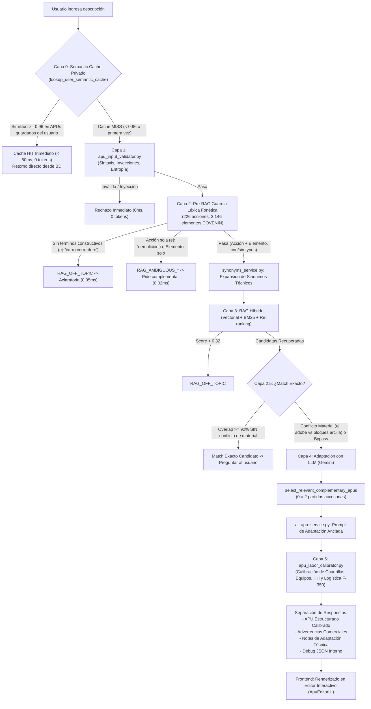

# Generador de APU con Inteligencia Artificial (Costbase / APUPro Platform)
## Guía Maestra de Arquitectura, Pipeline Multi-Capa y Manual de Mantenimiento

> **Módulo:** `costbase` / `cost360`  
> **Funcionalidad:** Generador de Análisis de Precios Unitarios (APU) con Inteligencia Artificial (Función Premium)  
> **Última Actualización:** Septiembre 2026  
> **Normativa de Referencia:** COVENIN 2000:1992 (Sector Construcción Venezuela)  
> **Base de Datos Oficial:** PostgreSQL (`cost360_items`) con **17.408 partidas** históricas y codificadas  

---

## Índice General de la Documentación
1. [Descripción General](#1-descripción-general)
2. [Mapa de Archivos del Sistema](#2-mapa-de-archivos-del-sistema)
3. [Flujograma General del Pipeline de 6 Capas](#3-flujograma-general-del-pipeline-de-6-capas)
4. [Capa 0: Caché Semántico Privado de APUs por Usuario (< 50ms, 0 Tokens)](#4-capa-0-caché-semántico-privado-de-apus-por-usuario--50ms-0-tokens)
5. [Capa 5: Calibrador Determinista de Cuadrillas, Equipos y Rendimiento (HH)](#5-capa-5-calibrador-determinista-de-cuadrillas-equipos-y-rendimiento-hh)
6. [Pipeline de Validación, Léxico y Adaptación LLM (Capas 1, 2, 2.5, 3 y 4)](#6-pipeline-de-validación-léxico-y-adaptación-llm-capas-1-2-25-3-y-4)
7. [Arquitectura Frontend y Editor Universal de APUs](#7-arquitectura-frontend-y-editor-universal-de-apus)
8. [Códigos Internos de Auditoría y Respuestas de la API](#8-códigos-internos-de-auditoría-y-respuestas-de-la-api)
9. [Manual Práctico de Mantenimiento y Batería de Pruebas](#9-manual-práctico-de-mantenimiento-y-batería-de-pruebas)
10. [Bitácora de Actualizaciones Críticas: 17 de Septiembre 2026](#10-bitácora-de-actualizaciones-críticas-17-de-septiembre-2026)

---

## 1. Descripción General

El **Generador de APU con IA** es la funcionalidad insignia de APUPro Platform (Costbase). Su objetivo es transformar una solicitud técnica en lenguaje natural (ej. *"Construcción de pared de bloques de arcilla e=15cm con mortero 1:4"* o *"Demolición de losa de concreto con acarreo de escombros"*) en un **Análisis de Precios Unitarios (APU) riguroso, balanceado y listo para presupuestar o licitar** en Venezuela.

A diferencia de generadores genéricos que "alucinan" cuadrillas o inventan precios y rendimientos irreales, APUPro opera bajo una arquitectura **Multi-Capa Defensiva de 6 Capas con RAG Híbrido, Adaptación Anclada y Calibración Determinista**:

0. **Capa 0: Caché Semántico Privado por Usuario (< 50ms, 0 Tokens):** Intercepta la consulta contra la base de datos privada del usuario (`cost360_custom_items`). Si existe un APU previamente guardado con similitud de coseno $\ge 0.96$, lo entrega al instante sin gastar tokens ni invocar al LLM.
1. **Defensa Temprana Fail-Fast (< 1ms, 0 Tokens):** Intercepta texto abusivo, inyecciones SQL/Prompt, entradas ambiguas (*"demolicion"*) o fuera de tema (*"carro corre duro"*, *"la moto corre mucho"*) **antes** de consumir cuotas o saturar la base de datos.
2. **Léxico COVENIN Oficial con Tolerancia Fonética:** Clasificador en memoria con **226 acciones** y **3.146 elementos/materiales** extraídos de las 17.408 partidas reales, capaz de reconocer variantes ortográficas venezolanas (*acareo*, *contruccion*, *excabacion*, *valdosas*).
3. **Guardia de Conflicto de Material en Match Exacto:** Si el texto coincide formalmente con una partida pero difiere en el material (ej. el usuario pide *"adobe"* y el catálogo tiene *"bloques huecos de arcilla"*), se bloquea el match exacto y se deriva al generador con IA.
4. **Anclaje de Rendimientos e Insumos Reales (RAG Híbrido):** Selecciona la partida histórica más afín y utiliza su estructura de costos (mano de obra, equipos, materiales) como base madre, fusionando complementarias solo si el alcance lo exige.
5. **Capa 5: Motor Determinista de Calibración de Cuadrillas, Equipos y HH (`apu_labor_calibrator.py`):** Calibra matemáticamente las cuadrillas, oficios, ayudantes, supervisión menor, logística inteligente de vehículos utilitarios (F-350 / Pick-up a 0.25 día), degradación de maquinaria pesada, herramientas y horas-hombre basadas en las 17.408 partidas de la base oficial.

---

## 2. Mapa de Archivos del Sistema

```
apupro_platform/
├── backend/
│   ├── app/
│   │   ├── api/v1/endpoints/
│   │   │   └── costbase.py                 # Endpoint principal /generate-ai-apu, Capa 0 y orquestación
│   │   ├── services/
│   │   │   ├── user_semantic_cache.py       # Capa 0: Caché semántico privado, embeddings y similitud
│   │   │   ├── apu_input_validator.py       # Capas 1 y 2: Sanitización, Guardia Léxica y Fonética
│   │   │   ├── synonyms_service.py          # Normalización de modismos y siglas técnicas
│   │   │   ├── ai_search.py                 # Motor RAG: Embeddings, BM25 y Re-ranking
│   │   │   ├── ai_apu_service.py            # Capa 4: Prompting LLM, adaptación y podado
│   │   │   ├── apu_labor_calibrator.py      # Capa 5: Calibrador determinista de cuadrillas, equipos y HH
│   │   │   ├── llm_router.py                # Abstracción multi-proveedor (Gemini, OpenAI, etc.)
│   │   │   └── data/
│   │   │       └── construction_lexicon.json # Léxico oficial (226 acciones, 3.146 elementos)
│   │   └── evaluations/
│   │       ├── golden_dataset_input_validation.py # 56 casos de prueba etiquetados
│   │       └── run_input_validation_tests.py      # Runner de validación por capas
│   ├── tests/
│   │   ├── test_labor_calibrator.py         # Suite de 15 pruebas unitarias de calibración y logística
│   │   └── test_user_semantic_cache.py      # Suite de 12 pruebas de similitud, HIT/MISS y privacidad
│   ├── scripts/
│   │   └── compile_construction_lexicon.py  # Compilador de léxico desde PostgreSQL
│   └── smoke_test_validator.py              # Suite de 34 tests unitarios de validación y typos
│
└── frontend/src/
    ├── components/
    │   ├── ApuEditorUI.jsx                  # Editor de APU completo con cálculo reactivo y modales
    │   ├── ComponentSelectorModal.jsx       # Modal de selección de materiales, equipos y mano de obra
    │   └── ComponentSearchModal.jsx         # Modal de búsqueda para presupuestos
    └── modules/costbase/
        ├── pages/
        │   ├── AIApuGeneratorPage.jsx       # Vista orquestadora modular con IA y Asistente Guiado
        │   └── APUViewer.jsx                # Visor y editor de APUs de bases certificadas y personalizadas
        ├── hooks/
        │   ├── useApuGenerator.js           # Hook: Llamadas API, estados, toast semántico y debug
        │   └── useGuidedAssistant.js        # Hook: Estado del Asistente Guiado (5 pasos)
        ├── constants/
        │   └── guidedBuilderConstants.js    # Opciones, chips y prompts de las 5 fases
        └── components/ai-generator/
            ├── ApuGeneratorHeader.jsx       # Encabezado contextual y tabs de modo
            ├── ClarificationAlertCard.jsx   # Tarjeta ámbar sin opciones adivinadas
            ├── ExactMatchCard.jsx           # Tarjeta interactiva de match exacto
            ├── GuidedAssistantModal.jsx     # Modal del Asistente Guiado paso a paso
            ├── FreeTextPromptInput.jsx      # Input de texto libre y botón Generar APU
            ├── SmartFilterCard.jsx          # Tarjeta de preguntas discriminantes
            ├── ImportFromDbPanel.jsx        # Panel de clonación de bases de datos
            └── DatabasePreviewList.jsx      # Visor colapsable de partidas históricas
```

---

---

## 3. Flujograma General del Pipeline de 6 Capas

El pipeline de procesamiento se ejecuta en 6 capas defensivas estrictamente ordenadas:



---

## 4. Capa 0: Caché Semántico Privado de APUs por Usuario (< 50ms, 0 Tokens)

* **Propósito Central:** Si un usuario pide una partida idéntica o con $\ge 96\%$ de similitud semántica a una que ya validó y guardó previamente en su presupuesto, el sistema **no vuelve a llamar al LLM ni consume tokens**. Responde en **menos de 50 milisegundos**.
* **Tiempo de Respuesta:** `< 50 ms` | **Costo:** `0 tokens de LLM` | **Aislamiento:** `Multi-tenant Estricto (Zero-Leak)`.
* **Detonador de Aprendizaje (Trigger):** Al presionar *"Guardar APU Generado"* (`POST /api/v1/cost360/custom-apus`), la función `save_custom_apu` vectoriza automáticamente la descripción con `ai_engine.encode_query` y almacena el vector embedding JSON en `cost360_custom_items.embedding`.
* **Mecanismo Matemático de Intercepción:**
  1. En `/generate-ai-apu`, **antes** de evaluar el RAG o llamar a Gemini, el backend consulta únicamente las partidas de `cost360_custom_items` donde `user_id == current_user.id`.
  2. Calcula la similitud de coseno en NumPy:
     $$\text{Similitud}(u, v) = \frac{u \cdot v}{\|u\| \|v\|}$$
  3. Si la similitud con un APU ya aprobado por este usuario es $\ge \mathbf{0.96}$, se reconstruye el APU directamente desde el JSON con `source: "user_semantic_cache"` y se devuelve de inmediato.
* **Aislamiento Estricto de Privacidad:** Se descartaron cachés comunitarios o globales públicos. Las partidas guardadas de un usuario pertenecen única y exclusivamente a su cuenta; ningún otro usuario puede consultar ni indexar sus APUs.
* **Experiencia de Usuario en Frontend:** Al recibir un APU desde la Capa 0, el frontend emite una notificación reactiva:
  `⚡ APU recuperado de tus partidas guardadas (X% similitud)`.
* **Tolerancia y Auto-Reparación de Base de Datos:** `backend/app/main.py` y `save_custom_apu` ejecutan auto-migración y auto-reparación preventiva (`ALTER TABLE cost360_custom_items ADD COLUMN IF NOT EXISTS embedding TEXT;`) junto con fallback SQL para garantizar cero caídas (500).

---

## 5. Capa 5: Calibrador Determinista de Cuadrillas, Equipos y Rendimiento (HH)

* **Archivo del Motor:** [`backend/app/services/apu_labor_calibrator.py`](file:///c:/Users/pablo/Documents/apupro_platform/backend/app/services/apu_labor_calibrator.py)
* **Propósito:** Corregir matemáticamente cualquier desbalance, oficio incompatible, sobrecosto o alucinación de cuadrillas y rendimientos físicos generados por el LLM antes de mostrar el APU al usuario.

### 5.1 Estudio Empírico de la Base de Datos Oficial (17.408 Partidas)
El motor de calibración se diseñó mediante un estudio exhaustivo de la base de datos oficial COVENIN, contrastando especialmente:
1. **1.422 Partidas R (Reparaciones, Reformas y Remociones):**
   - **Comportamiento en `und` / `pza`:** Se comprobó que el 90% de las partidas de reparación puntual de elementos tienen un rendimiento real de **$1.0\text{ a }1.5\text{ und/día}$** (mediana = 1.00), desmintiendo los 12.0 und/día que alucinaba el LLM.
   - **Logística de Vehículos Utilitarios:** El segundo equipo más recurrente en reparaciones es el `CAMION FORD F- 350 ESTACAS` (110 partidas) y `CAMIONETA PICK-UP` (43 partidas), con una asignación estándar de **$0.25\text{ a }0.50\text{ día}$**, acompañado por su respectivo `CHOFER` (152 partidas).
2. **1.483 Partidas M (Mantenimiento, Montaje y Mecánica):**
   - Evidenció la necesidad de desacoplar maquinaria pesada (volquetes 750, grúas pesadas, chutos) heredadas de obras viales de gran escala cuando la intervención es en sitio o en altura.

### 5.2 Reglas Deterministas de Calibración
1. **Preservación del Vehículo Utilitario de Apoyo Logístico:**
   - Para cuadrillas de mantenimiento, herrería y reparaciones en sitio, el vehículo utilitario (`CAMION FORD F-350 ESTACAS` o `CAMIONETA PICK-UP`) **NO se elimina**.
   - Se preserva y acota a una escala representativa de **$0.25\text{ día}$**, reconociendo el costo del traslado logístico de la cuadrilla y herramientas hasta la obra.
2. **Degradación Inteligente de Maquinaria Pesada:**
   - Si la partida base del RAG o el LLM introdujo camiones 750, gandolas, chutos, volquetes pesados o grúas industriales fuera de escala para una reparación en sitio, el sistema los degrada automáticamente a **Camión F-350 a $0.25\text{ día}$**.
3. **Sincronización Automática del Chofer:**
   - Todo vehículo de apoyo en la sección de equipos garantiza la presencia de su correspondiente **`CHOFER` a $0.25\text{ día}$** en la mano de obra.
4. **Proporcionalidad y Sustitución de Oficios Incompatibles:**
   - Si para una estructura metálica la base heredó `ALBAÑIL` o `CABILLERO`, se convierten automáticamente en **`HERRERO DE 1RA`** o **`SOLDADOR DE 1RA`**.
5. **Control de Supervisión Menor:**
   - Detecta cargos de maestros de obra (`MAESTRO CABILLERO`, `MO-DIR`) y los normaliza como supervisión menor (`CAPORAL` $\le 0.25\text{ día}$) para que no inflen la cuadrilla operativa.
6. **Racionalización de Ayudantes:**
   - En reparaciones y refuerzos en sitio, la mano de obra no calificada se acota a **máximo 1.0 ayudante por especialista**.
7. **Selección Inteligente de Herramientas Eléctricas Menores (Amoladora 4 1/2" vs Esmeril 7"):**
   - **Mantenimiento en sitio (peldaños de escaleras $1\times 0.32\text{ m}$, barandas, rejas, marcos):** Se asigna exclusivamente una **Amoladora Angular de 4 1/2" con cepillo de alambre de acero** (`EQU-HER-045`, \$55, dep 0.01). Si el RAG o LLM introdujo un esmeril industrial pesado de 7", el calibrador lo sustituye automáticamente para respetar la ergonomía y accesibilidad física del elemento instalado.
   - **Fabricación y montaje pesado de perfiles:** Se reserva el **Esmeril Angular Industrial de 7"** (`EQU-HER-056`, \$120) para corte y desbaste de planchas y perfiles estructurales en taller o patio.
8. **Prioridad de la Acción de Pintura sobre el Sustrato Metálico:**
   - En labores de mantenimiento o protección con esmalte/anticorrosivo sobre elementos de herrería instalados (escaleras, barandas, peldaños), la tipología operativa se clasifica como **`PINTURA`**, evitando que se aplique erróneamente la tasa de fabricación pesada de estructuras metálicas.
9. **Blindaje Dimensional Estricto en HH y Nuevos Benchmarks:**
   - Queda terminantemente prohibido el cruce de unidades físicas (nunca se compara un rendimiento en $\text{m}^2$ contra benchmarks en $\text{und}$ o $\text{kgf}$).
   - Se incorporaron benchmarks directos empíricos:
     - `PINTURA_m2`: Mediana 0.80 HH/m² $\rightarrow$ **$30 - 32\text{ m}^2/\text{día}$** para cuadrilla típica.
     - `PINTURA_pza`: Mediana 1.20 HH/pza $\rightarrow$ **$20\text{ pza/día}$**.
     - `PINTURA_und`: Mediana 1.50 HH/und $\rightarrow$ **$16\text{ und/día}$**.
     - `ESTRUCTURAS_METALICAS_m2`: Mediana 4.00 HH/m² $\rightarrow$ **$6\text{ m}^2/\text{día}$**.
     - `ESTRUCTURAS_METALICAS_und`: Mediana 24.00 HH/und $\rightarrow$ **$1.0 - 1.5\text{ und/día}$**.
     - `REPARACIONES_PUNTUALES_pza`: Mediana 2.40 HH/pza $\rightarrow$ **$8.0\text{ pza/día}$**.

### 5.3 Parámetro Obligatorio de Unidad para Mantenimiento y Reparación
Para evitar que el LLM intente adivinar la unidad de medida y distorsione el rendimiento o el escalamiento de materiales, el sistema implementa una compuerta estricta:
* **Términos Monitoreados:** `mantenimiento`, `saneamiento`, `reconstruccion`, `arreglo`, `reparacion`, `rehabilitacion`, `restauracion`.
* **Parámetro de Primera Clase (`unit: str`):** La API recibe la unidad directamente como parámetro (`payload.unit`), transmitiéndose formalmente desde el frontend hasta la directiva estricta de Gemini.
* **Compuerta Temprana Fail-Fast en API:** Si se detecta una actividad de mantenimiento y el analista no suministró la unidad, la API frena en Capa 1 y devuelve `clarification_needed` solicitando elegir entre:
  `pza` (Por Pieza / Peldaño), `und` (Por Unidad), `m2` (Superficie desarrollada), `m` (Metro lineal).
* **Experiencia en Modo Libre:** Un banner interactivo con chips de selección rápida se activa reactivamente en el input de texto libre y bloquea el envío hasta que la unidad esté seleccionada.
* **Experiencia en Asistente Guiado (Chatbot):** El Paso 5 detecta la actividad de mantenimiento y despliega únicamente los chips válidos (`pza`, `und`, `m²`, `m`), eliminando la opción de *"Sugerir por IA"*.

---

## 6. Pipeline de Validación, Léxico y Adaptación LLM (Capas 1, 2, 2.5, 3 y 4)

### Fase 1: Capa 1 — Sanitización Sintáctica y Seguridad (`apu_input_validator.py`)
* **Tiempo:** `< 1 ms` | **Costo:** `0 tokens` | **Red:** `Ninguna`
* **Verificaciones:** Longitud (10-500 caracteres), Inyecciones SQL/HTML/Prompt, Entropía de Shannon ($\ge 2.5$), relación de vocales (20-75%).

### Fase 2: Capa 2 — Guardia Léxica Pre-RAG y Tolerancia Fonética
* **Léxico Oficial COVENIN (`construction_lexicon.json`):** 226 acciones constructivas y 3.146 elementos físicos y materiales.
* **Tolerancia Fonética O(1) (`_spanish_ortho_normalize`):** Betacismo (`v`/`b`), seseo (`c`/`s`/`z`), omisión de `s` preconsonántica (*contruccion*), geminadas reducidas (*acareo*).
* **Guardia Anti-Falsos Positivos:** Palabras cotidianas no constructivas (*carro*, *moto*, *pizza*) nunca pasan como términos técnicos.

### Fase 3: Capa 2.5 — Detección de Match Exacto y Guardia de Conflicto de Material
* Match exacto ($\ge 92\%$) con partida de catálogo **únicamente si no hay conflicto técnico de material** (ej. si el usuario pide *adobe* y el catálogo tiene *bloques de arcilla*, se bloquea el match exacto y se deriva al generador con IA).

### Fase 4: Capa 3 — Búsqueda RAG Híbrida y Complementarias
* Expansión de sinónimos técnicos (`synonyms_service.py`), búsqueda semántica y auto-fusión de hasta 2 partidas accesorias solo si el alcance no es autosuficiente.

### Fase 5: Capa 4 — Adaptación Anclada con LLM (`ai_apu_service.py`)
* Prompting técnico anclado: precios unitarios intocables, código SC de partida especial, anclaje de rendimientos oficiales y supresión de opciones adivinadas en clarificación (`options: []`).

---

## 7. Arquitectura Frontend y Editor Universal de APUs

El frontend de generación y edición de APUs está organizado bajo principios de Clean Architecture y Responsabilidad Única (SRP):

### 7.1 Custom Hooks de Negocio
* **[`useApuGenerator.js`](file:///c:/Users/pablo/Documents/apupro_platform/frontend/src/modules/costbase/hooks/useApuGenerator.js):**
  * Gestiona las peticiones a la API (`generateAIApu`) aceptando el parámetro explícito de unidad (`unit: str`).
  * Controla estados de carga por fases (*Analizando semántica*, *Buscando en base COVENIN*, *Adaptando APU*).
  * Maneja respuestas de aclaratoria (`clarification_needed`) y match exacto (`exact_match_candidate`).
  * **Detección de Caché Semántico:** Identifica `response.source === 'user_semantic_cache'` y emite un toast reactivo instantáneo: `⚡ APU recuperado de tus partidas guardadas (X% similitud)`.
  * Administra la descarga automática del archivo de diagnóstico JSON (`debug_apu_*.json`) enriquecido con el listado completo de insumos de materiales, equipos y mano de obra.
* **[`useGuidedAssistant.js`](file:///c:/Users/pablo/Documents/apupro_platform/frontend/src/modules/costbase/hooks/useGuidedAssistant.js):**
  * Controla el asistente conversacional interactivo (Pasos 1 a 5).
  * En el Paso 5, detecta actividades de mantenimiento/reparación y restringe las unidades válidas a `pza`, `und`, `m²` y `m`, bloqueando intentos de omitir o sugerir automáticamente por IA.
  * Extrae la unidad seleccionada y la transmite como argumento independiente en `onComplete(finalPrompt, 'chat', extractedUnit)` hacia `handleGenerate`.

### 7.2 Componentes UI Especializados
* **[`ApuEditorUI.jsx`](file:///c:/Users/pablo/Documents/apupro_platform/frontend/src/components/ApuEditorUI.jsx):**
  * Editor tabular interactivo universal para APUs generados, certificados y de presupuestos.
  * Realiza el cálculo reactivo en tiempo real de costos directos (materiales, equipos con factor de depreciación, mano de obra con FCAS e incidencias) y costos indirectos (administración, utilidad, IVA).
  * **Sincronización de Equipos y Depreciación:** Al hacer clic en la lupa de fila o en el botón general de búsqueda, propaga tanto el precio unitario de adquisición como el factor de depreciación diario (`depreciacion`), evitando que la fila conserve valores estáticos de `1.0`.
  * **Visibilidad de Acciones:** El botón de eliminación (ícono de papelera) permanece siempre visible en la fila para facilitar la remoción rápida de componentes.
* **[`FreeTextPromptInput.jsx`](file:///c:/Users/pablo/Documents/apupro_platform/frontend/src/modules/costbase/components/ai-generator/FreeTextPromptInput.jsx):**
  * Textarea con auto-ajuste de altura y conmutador entre modo Asistente y Entrada Libre.
  * **Detección Reactiva de Mantenimiento:** Al escribir términos de mantenimiento/reparación, despliega dinámicamente el panel interactivo con chips de unidad obligatoria (`pza`, `und`, `m²`, `m`).
  * **Validación Bloqueante:** Impide generar la partida si el usuario no ha seleccionado una unidad obligatoria, mostrando un aviso contextual antes del envío.
* **[`GuidedAssistantModal.jsx`](file:///c:/Users/pablo/Documents/apupro_platform/frontend/src/modules/costbase/components/ai-generator/GuidedAssistantModal.jsx):**
  * Modal interactivo del Asistente Guiado de 5 pasos con stepper visual y rebobinado reversible.
  * En el Paso 5, presenta los chips de unidad técnica y adapta dinámicamente el placeholder del chat según la actividad.
* **[`ClarificationAlertCard.jsx`](file:///c:/Users/pablo/Documents/apupro_platform/frontend/src/modules/costbase/components/ai-generator/ClarificationAlertCard.jsx):**
  * Tarjeta ámbar limpia sin botones de alternativas adivinadas.
  * Presenta la guía de **REDACCIÓN RECOMENDADA** y las preguntas clave.
  * Muestra los botones de acción: `[Usar Asistente Guiado Paso a Paso]` y `[Reiniciar Entrada Libre]` / `[Reiniciar Chatbot]`.
* **[`ExactMatchCard.jsx`](file:///c:/Users/pablo/Documents/apupro_platform/frontend/src/modules/costbase/components/ai-generator/ExactMatchCard.jsx):**
  * Permite adoptar con un solo clic una partida existente en base de datos sin gastar cuota mensual de IA.

---

## 8. Códigos Internos de Auditoría y Respuestas de la API

La API `/generate-ai-apu` devuelve una estructura JSON estándar con códigos de diagnóstico para auditoría interna:

| Código Interno / Origen | Estado HTTP | Veredicto | Significado Técnico |
|---|:---:|:---:|---|
| `user_semantic_cache` | 200 | `completed` | **Cache HIT:** APU idéntico o semánticamente equivalente ($\ge 0.96$) recuperado de la base privada del usuario en <50ms (0 tokens). |
| `SQL_INJECTION` | 200 | `reject` | Intento de inyección SQL interceptado en Capa 1. |
| `PROMPT_INJECTION` | 200 | `reject` | Intento de manipulación de instrucciones LLM en Capa 1. |
| `HTML_INJECTION` | 200 | `reject` | Inyección de etiquetas HTML o scripts en Capa 1. |
| `LOW_ENTROPY` | 200 | `reject` | Texto repetitivo o monótono en Capa 1 (*"demolicion demolicion..."*). |
| `RAG_OFF_TOPIC` | 200 | `reject` / `clarification_needed` | Entrada sin términos constructivos (*"carro corre duro"*, *"pizza"*) o score RAG $< 0.32$. |
| `RAG_AMBIGUOUS_ACTION_ONLY` | 200 | `clarification_needed` | Entrada con verbo constructivo pero sin elemento físico (*"demolicion"*, *"instalacion"*). |
| `RAG_AMBIGUOUS_ELEMENT_ONLY` | 200 | `clarification_needed` | Entrada con elemento constructivo pero sin acción técnica (*"tuberia"*, *"valdosas"*). |
| `RAG_ACARREO_MISSING_UNIT` | 200 | `clarification_needed` | Entrada de acarreo/transporte sin unidad (`m3.m`, `m3`, `m3xkm`, `sac.m`, `vje`) ni distancia o método. |
| `RAG_NO_CANDIDATES` | 200 | `reject` | La búsqueda vectorial no arrojó ninguna partida afín en el catálogo. |
| `exact_match_candidate` | 200 | `exact_match_candidate` | Partida oficial de catálogo con coincidencia exacta de texto y material. |

### Formato de Respuesta en Aclaratoria
```json
{
  "status": "clarification_needed",
  "clarification_message": "La descripción es demasiado breve para generar un APU preciso. Por favor describe la actividad con al menos el elemento constructivo y la acción a ejecutar.",
  "recommendation": "Te recomendamos utilizar el Asistente Guiado para estructurar tu descripción paso a paso.",
  "options": [],
  "questions": [
    "1. Acción principal: ¿Qué actividad deseas presupuestar (demolición, construcción, instalación)?",
    "2. Elemento constructivo: ¿Sobre qué elemento se actúa (pared, tubería, losa, piso)?",
    "3. Material o especificación: ¿Qué material o resistencia tiene (bloque, PVC, concreto)?",
    "4. Método y alcance: ¿Se realiza a mano o con maquinaria? ¿Incluye bote o transporte?"
  ],
  "guia_redaccion": "Estructura recomendada: [Acción] + [Elemento] + [Material/Especificación] + [Método].",
  "_internal_code": "RAG_AMBIGUOUS_ACTION_ONLY"
}
```

---

## 9. Manual Práctico de Mantenimiento y Batería de Pruebas

### 6.1 ¿Cómo re-compilar el Léxico Constructivo tras agregar partidas a PostgreSQL?
Si se importan o modifican partidas en la tabla `cost360_items`, ejecuta el compilador oficial:
```bash
cd backend
python scripts/compile_construction_lexicon.py
```
Este script analiza las descripciones, extrae las acciones y elementos morfológicos y actualiza automáticamente `backend/app/services/data/construction_lexicon.json`.

### 6.2 ¿Cómo agregar nuevas reglas de Tolerancia Ortográfica Fonética?
Abre [`backend/app/services/apu_input_validator.py`](file:///c:/Users/pablo/Documents/apupro_platform/backend/app/services/apu_input_validator.py) y edita la función `_spanish_ortho_normalize(w: str)`:
```python
# Ejemplo: incorporar asimilación de 'll' a 'y'
w = w.replace("ll", "y")
```
Al reiniciar el servidor, `_ACTION_ORTHO_MAP` y `_ELEMENT_ORTHO_MAP` se pre-computan automáticamente con la nueva regla.

### 6.3 ¿Cómo agregar un nuevo Modismo o Término Técnico?
Abre [`backend/app/services/synonyms_service.py`](file:///c:/Users/pablo/Documents/apupro_platform/backend/app/services/synonyms_service.py) y agrega la tupla en `TECHNICAL_SYNONYMS`:
```python
(r"\b(NUEVO_TERMINO|VARIANTE)\b", "EQUIVALENTE_NORMATIVO_COVENIN"),
```

### 6.4 ¿Cómo ejecutar la Batería Completa de Pruebas Automatizadas?
1. **Calibrador de Mano de Obra, Equipos y Rendimientos (15 pruebas unitarias):**
   ```bash
   cd backend
   python -m unittest tests/test_labor_calibrator.py
   ```
2. **Caché Semántico Privado de Usuarios (12 pruebas unitarias de similitud, HIT/MISS y privacidad):**
   ```bash
   cd backend
   python -m unittest tests/test_user_semantic_cache.py
   ```
3. **Suite Completa de Pruebas Backend (27 pruebas en total):**
   ```bash
   cd backend
   python -m unittest discover -s tests -p "test_*.py"
   ```
4. **Smoke Tests de Entrada y Léxico (34 pruebas de seguridad y typos):**
   ```bash
   cd backend
   python smoke_test_validator.py
   ```
5. **Evaluación de Golden Dataset por Capas (56 casos etiquetados):**
   ```bash
   cd backend
   python -m app.evaluations.run_input_validation_tests --capa 2
   ```
6. **Verificación de Compilación Frontend:**
   ```bash
   cd frontend
   npm run build
   ```

---

## 10. Bitácora de Actualizaciones Críticas: 17 de Septiembre 2026

Durante esta jornada se ejecutaron cinco optimizaciones mayores sobre la arquitectura del Generador de APU y el Asistente Guiado:

### 10.1 Detección Inteligente de Descripciones Completas en el Chatbot
- **Problema previo:** Si el usuario pegaba una descripción completa de obra en el chat del Asistente Guiado, el asistente continuaba mecánicamente con las preguntas de los 5 pasos o presentaba la opción ambigua de *"Desglosar en 5 pasos"* vs *"Generar de inmediato"*, permitiendo además que el usuario escribiera en el input sin seleccionar una unidad técnica.
- **Solución implementada:**
  1. El chatbot ahora detecta cuando el texto contiene una descripción constructiva completa y comprensible.
  2. Suprime los pasos intermedios redundantes y pasa de inmediato a preguntar la unidad de cómputo: `Indica la unidad de la partida`.
  3. Los chips de selección rápida se limpiaron para mostrar exclusivamente el símbolo formal (`und`, `pza`, `m²`, `m`, `m³`, `Gl`) eliminando el prefijo repetitivo `"Unidad: "`.
  4. El campo de entrada de texto libre y el botón de enviar se ocultan condicionalmente mientras existan botones de acción/decisión en pantalla, centrando los botones principales para guiar al usuario sin bifurcaciones accidentales.

### 10.2 Soporte Arquitectónico de Partidas Globales (`Gl` / Suma Global / S.G.)
- **Problema de ingeniería:** Aunque la norma COVENIN desalienta el uso indiscriminado de S.G., en proyectos reales existen partidas que se contratan a suma alzada por el paquete completo (ej. *"Aplicación de pintura en escalera metálica incluyendo barandas, pasamanos y descansos"*). Tratar de inventar rendimientos por IA introducía variables inestables y propensas a error.
- **Modelo matemático adoptado:**
  1. **Solicitud de Duración al Analista:** El sistema solicita los días hábiles estimados de trabajo de cuadrilla ($D$).
  2. **Rendimiento Diario Estricto:** Se calcula deterministamente como:
     $$R = \frac{1.0}{D} \quad \text{(ej. para } D = 5.0 \text{ días} \implies R = 0.20 \text{ Gl/día)}$$
  3. **Cuadrilla y Equipos:** Trabajan a jornada diaria normal. Al aplicar la fórmula universal de APU, el costo diario dividido entre $R$ multiplica exactamente por los $D$ días de obra.
  4. **Materiales en Bulto Total:** El consumo de materiales no es por metro cuadrado ni por metro lineal, sino el 100% acumulado de insumos físicos necesarios para completar toda la obra descrita (galones, perfiles, etc.).

### 10.3 Corrección en Persistencia y Guardado de APUs con Errores
- Se corrigieron los problemas de validación en el editor [`ApuEditorUI.jsx`](file:///c:/Users/pablo/Documents/apupro_platform/frontend/src/components/ApuEditorUI.jsx) donde partidas con campos nulos o formatos numéricos no sanitizados disparaban alertas de error que impedían guardar y corregir partidas en la base de datos.

### 10.4 Preservación de Procedencia de Materiales (`origen: "historico"` vs `"ia"`)
- **Problema diagnosticado:** En el archivo de depuración `debug_apu_2026-09-17T23-10-55-743Z.json`, todos los materiales aparecían etiquetados con `"origen": "ia"` (mostrando el badge morado de IA en el editor), lo que generaba la impresión de que el sistema no tomó los materiales ni los precios de la base de datos.
- **Causa raíz:** La Regla 5 del prompt ordenaba marcar como `"origen": "ia"` a cualquier insumo al que se le ajustara la cantidad. Al adaptar una partida a escala global `Gl`, el modelo escaló las cantidades y cambió automáticamente todos los tags a `"ia"`, a pesar de que los insumos y precios provenían íntegramente de la partida base histórica (`GEL258`).
- **Solución implementada:**
  1. Se actualizó `_REGLAS_ORIGEN` y la Regla 5 en [`ai_apu_service.py`](file:///c:/Users/pablo/Documents/apupro_platform/backend/app/services/ai_apu_service.py) instruyendo que los insumos de la partida base o complementarias **conservan obligatoriamente `"origen": "historico"`**, aun si sus cantidades fueron recalculadas o escaladas a bulto global.
  2. Se creó la función `_enforce_base_apu_material_heritage` que analiza la respuesta previa a la entrega y garantiza que todo material coincidente con la base herede su procedencia histórica, su código oficial y su precio base.

### 10.5 Reconciliador Determinista de Materiales contra Base de Datos
- **Función:** [`reconcile_materials_with_database`](file:///c:/Users/pablo/Documents/apupro_platform/backend/app/services/ai_apu_service.py#L480) y [`_execute_material_reconciliation`](file:///c:/Users/pablo/Documents/apupro_platform/backend/app/services/ai_apu_service.py#L400).
- **Mecanismo:**
  1. **Búsqueda por Código:** Cruza los códigos contra `cost360_materials` (`CodMat` o `ref_code`).
  2. **Búsqueda Léxica Multi-Token:** Para insumos nuevos con código provisional o etiqueta `ia`, busca en `cost360_materials` mediante filtrado de tokens significativos y descarte de stopwords.
  3. **Anclaje Certificado:** Si el material existe en el catálogo, asigna su código oficial (`PIN003`, `PIN135`, etc.), su precio unitario de catálogo (`CosMat`), su unidad oficial (`UniMat`), cambia su procedencia a `historico` y purga la advertencia `[PRECIO_REFERENCIAL]`.
  4. **Preservación de Sugerencias de IA:** Si el material sugerido por la IA no existe en la base de datos (material nuevo o especial), **se conserva intacto en el APU** con su precio referencial estimado y su respectiva alerta comercial para cotizarlo con proveedores.
  5. **Integración:** El reconciliador quedó activo en el motor RAG adaptativo, en el motor clásico y en el motor matemático inverso ([`inverse_apu_synthesizer.py`](file:///c:/Users/pablo/Documents/apupro_platform/backend/app/services/inverse_apu_synthesizer.py)).

#### 10.6 Cobertura Total de Insumos Líderes y Familias Yeso/Anime
- **Familias Oficiales:** Se crearon `FAM-DRYWALL` (*Yeso, Drywall y Cielos Rasos*, líder `ACA014`) y `FAM-ANIME` (*Anime y Poliestireno Expandido*, líder `ESP004`).
- **Cobertura 100%:** Los 8.491 materiales de la base de datos (incluyendo los 1.404 huérfanos anteriores) quedaron asignados a sus 25 familias y vinculados a sus respectivos Insumos Líderes con su factor relativo `market_factor`.
- **Impacto en el Generador:** Todo material asignado o reconciliado en los APUs se mantiene automáticamente actualizado en sus costos unitarios al modificar el precio de su Insumo Líder en el panel de mercado.

---

## 11. Bitácora de Actualizaciones Críticas: 21–22 de Septiembre 2026

> **Contexto:** Ciclo de corrección de errores 500 en producción + optimización de tokens LLM + migración de proveedor a DeepSeek.

### 11.1 Migración de Proveedor LLM: Gemini → DeepSeek (Primario)

**Problema:** La cuota gratuita de Gemini (20 req/día, 5 req/min) se agotaba constantemente causando errores 500.

**Solución implementada:**
- Se registró **DeepSeek** (`deepseek-chat`) como proveedor LLM primario (`priority=1`, `use_case="cost360"`) con API de pago sin límite diario.
- **Gemini** (`gemini-3.6-flash`) pasó a `priority=2`, `use_case="general"` — exclusivo para embeddings RAG.
- Se actualizó [`llm_router.py`](file:///c:/Users/pablo/Documents/apupro_platform/backend/app/services/llm_router.py) agregando `"deepseek"` a la lista de proveedores compatibles con OpenAI.
- `base_url` de DeepSeek en BD: `https://api.deepseek.com/v1` (requiere el `/v1` explícito).
- `response_format: {"type": "json_object"}` habilitado para DeepSeek (soportado desde v3).

**Arquitectura final de proveedores:**

| Proveedor | Prioridad | Use Case | Propósito |
|-----------|-----------|----------|-----------|
| DeepSeek `deepseek-chat` | 1 | `cost360` | Generación de APU (sin cuota) |
| Gemini `gemini-3.6-flash` | 2 | `general` | Embeddings RAG + fallback |

---

### 11.2 Optimización de Tokens de Entrada al LLM (3 Medidas)

**Objetivo:** Reducir el contexto enviado al LLM de ~3.500 tokens a ~1.200 tokens.

#### Medida 1 — JSON Compacto
- **Archivo:** [`ai_apu_service.py`](file:///c:/Users/pablo/Documents/apupro_platform/backend/app/services/ai_apu_service.py)
- **Cambio:** `json.dumps(apu, indent=2)` → `json.dumps(apu, separators=(',', ':'))`
- **Impacto:** ~30% reducción de tokens en la serialización del APU base.

#### Medida 2 — Podado del APU Base (`_prune_apu_for_prompt`)
- **Función:** `_prune_apu_for_prompt(apu)` (línea ~692 en producción)
- **Lógica:** Elimina campos `None`, strings vacíos, `desperdicio=0.0`, redondea precios a 4 decimales, mantiene solo los campos relevantes para el prompt.
- **Campos eliminados por categoría:**
  - Materiales: solo `codigo`, `descripcion`, `unidad`, `cantidad`, `precio_unitario`
  - Equipos: solo `codigo`, `descripcion`, `cantidad`, `precio_unitario`
  - MO: solo `codigo`, `descripcion`, `cantidad`, `jornal`, `bono`

#### Medida 3 — Inyección Quirúrgica de Complementarias (`_extract_surgical_insumos`)
- **Función:** `_extract_surgical_insumos(apu, user_description)` con `SECONDARY_ACTIVITY_PATTERNS`
- **Lógica:** Si el usuario pide "bote", solo se inyecta el equipo de transporte (Camión volteo) de la complementaria, no toda la partida con insumos no relacionados.
- **Patrones:** `key_insumo_pattern` + `insumo_types` en el diccionario `SECONDARY_ACTIVITY_PATTERNS`.

---

### 11.3 Corrección de Bug Crítico: `extra_params` String vs Dict

**Error:** `'str' object has no attribute 'get'` — el campo `extra_params` de la tabla `llm_providers` se almacena como JSON string en PostgreSQL. SQLAlchemy lo retorna como `str`, y el código intentaba `extra.get("max_tokens")` directamente.

**Fix en [`llm_router.py`](file:///c:/Users/pablo/Documents/apupro_platform/backend/app/services/llm_router.py):**
```python
extra = provider.extra_params or {}
if isinstance(extra, str):
    try:
        extra = json.loads(extra)
    except (json.JSONDecodeError, TypeError):
        extra = {}
```

**Configuración correcta en BD para DeepSeek:**
```json
{"temperature": 0.3, "max_tokens": 8192}
```

> ⚠️ **Importante:** `max_tokens=8192` es crítico. Con 2048 (valor anterior), el JSON de un APU completo (~30 insumos) se truncaba y fallaba el parse.

---

### 11.4 Corrección de Bug: Números con Coma Decimal (`_safe_float`)

**Error:** `ValueError: could not convert string to float: '7,5'`

**Causa:** DeepSeek a veces devuelve valores numéricos con coma decimal española (`"7,5"`, `"3,5"`) en lugar de punto (`7.5`). Esto rompía todos los `float()` downstream.

**Solución — dos funciones en [`ai_apu_service.py`](file:///c:/Users/pablo/Documents/apupro_platform/backend/app/services/ai_apu_service.py):**

```python
def _safe_float(value: Any, default: float = 0.0) -> float:
    """Convierte '7,5' → 7.5, None → default, int/float → float."""
    if value is None: return default
    if isinstance(value, (int, float)): return float(value)
    if isinstance(value, str):
        return float(value.strip().replace(",", "."))
    return default

def _sanitize_llm_numbers(result: Dict[str, Any]) -> None:
    """Normaliza in-place todos los campos numéricos del resultado LLM."""
    # Aplica _safe_float a: partida.performance/quantity,
    # materials.cantidad/desperdicio/precio_unitario,
    # equipments.cantidad/depreciacion/precio_unitario,
    # labors.cantidad/jornal/bono
```

`_sanitize_llm_numbers` se llama **inmediatamente después de `call_llm_json`** en ambas funciones de generación, antes de cualquier otro procesado.

---

### 11.5 Salvaguarda Determinista de Exclusiones de Alcance (`_enforce_scope_exclusions`)

**Problema:** Cuando el usuario escribía *"no incluye el suministro de los materiales"*, el LLM entendía la exclusión en la descripción de la partida pero igual incluía los materiales en `materials[]`. El modelo no es 100% confiable siguiendo instrucciones de exclusión.

**Solución — función `_enforce_scope_exclusions(result, user_description)` en [`ai_apu_service.py`](file:///c:/Users/pablo/Documents/apupro_platform/backend/app/services/ai_apu_service.py):**

| Patrón detectado | Sección eliminada |
|-----------------|------------------|
| `"no incluye suministro"`, `"sin suministro"`, `"no incluye materiales"`, `"solo mano de obra"` | `materials[]` → `[]` |
| `"no incluye mano de obra"`, `"sin mano de obra"`, `"solo suministro"` | `labors[]` → `[]` |
| `"no incluye equipos"`, `"sin equipos"`, `"excluye equipos"` | `equipments[]` → `[]` |

La función usa `re.search` con patrones `\b` para evitar falsos positivos. Se llama **antes** de cualquier calibrador o reconciliador.

---

### 11.6 Corrección de Bug: JSON Double-Encoded en Parser LLM

**Error:** El parser `call_llm_json` en [`llm_router.py`](file:///c:/Users/pablo/Documents/apupro_platform/backend/app/services/llm_router.py) retornaba un `str` en lugar de `dict` cuando el LLM devolvía JSON doblemente codificado.

**Fix:**
```python
data = json.loads(cleaned)
# Guardia: si el JSON parseó como string (double-encoded), reintentar
if isinstance(data, str):
    data = json.loads(data)
if isinstance(data, (dict, list)):
    return data
raise ValueError(f"JSON parsed to unexpected type: {type(data).__name__}")
```

El mismo guard se aplica en los fallbacks de extracción regex (`{...}` y `[...]`).

---

### 11.7 Resumen de Commits (Sprint 21–22 Sep 2026)

| Commit | Descripción |
|--------|-------------|
| `a65c16d` | Optimización tokens LLM: JSON compacto + `_prune_apu_for_prompt` + `_extract_surgical_insumos` |
| `3596b12` | Fix DeepSeek: `max_tokens=8192`, `timeout=90s`, `response_format json_object`, `temp=0.3` |
| `525242c` | Fix exclusiones de alcance deterministas (`_enforce_scope_exclusions`) |
| `d59bd0b` | Fix `_safe_float` coma decimal + `_sanitize_llm_numbers` + `extra_params str→dict` in router |

### 11.8 Configuración de Producción (Estado al 22 Sep 2026)

```
Servidor: root@167.172.115.154
Container: apupro_platform-apupro-backend-1

LLM Providers (tabla llm_providers):
  ID=4  DeepSeek  deepseek-chat  priority=1  use_case=cost360
        base_url=https://api.deepseek.com/v1
        extra_params={"temperature": 0.3, "max_tokens": 8192}
  ID=1  Gemini    gemini-3.6-flash  priority=2  use_case=general
        (embeddings RAG + fallback)

AI_EMBEDDING_PROVIDER=gemini  (archivo .env en container)
Embeddings pre-generados: embeddings_gemini.npy (53MB en servidor)
```

> **Nota de mantenimiento:** Los cambios en `llm_providers` requieren `docker restart` del backend para invalidar el caché de 5 minutos de `_load_providers()` en `llm_router.py`. Alternativa: llamar `invalidate_llm_cache()` directamente.
