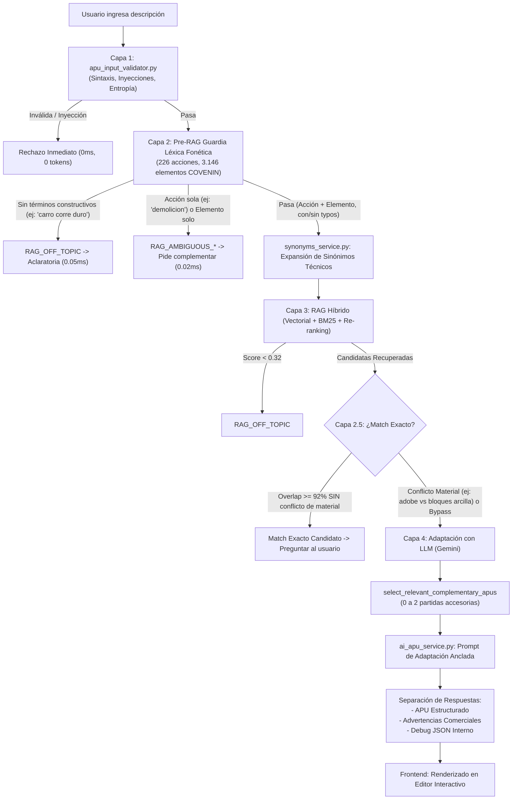

# Generador de APU con Inteligencia Artificial (Costbase / APUPro Platform)
## Guía Maestra de Arquitectura, Pipeline Multi-Capa y Manual de Mantenimiento

> **Módulo:** `costbase` / `cost360`  
> **Funcionalidad:** Generador de Análisis de Precios Unitarios (APU) con Inteligencia Artificial (Función Premium)  
> **Última Actualización:** Septiembre 2026  
> **Normativa de Referencia:** COVENIN 2000:1992 (Sector Construcción Venezuela)  
> **Base de Datos Oficial:** PostgreSQL (`cost360_items`) con **17.408 partidas** históricas y codificadas  

---

## 1. Descripción General

El **Generador de APU con IA** es la funcionalidad insignia de APUPro Platform (Costbase). Su objetivo es transformar una solicitud técnica en lenguaje natural (ej. *"Construcción de pared de bloques de arcilla e=15cm con mortero 1:4"* o *"Demolición de losa de concreto con acarreo de escombros"*) en un **Análisis de Precios Unitarios (APU) riguroso, balanceado y listo para presupuestar o licitar** en Venezuela.

A diferencia de generadores genéricos que "alucinan" cuadrillas o inventan precios y rendimientos irreales, APUPro opera bajo una arquitectura **Multi-Capa Defensiva con RAG Híbrido y Adaptación Anclada**:

1. **Defensa Temprana Fail-Fast (< 1ms, 0 Tokens):** Intercepta texto abusivo, inyecciones, entradas ambiguas (*"demolicion"*) o fuera de tema (*"carro corre duro"*, *"la moto corre mucho"*) **antes** de consumir tokens LLM o saturar la base de datos.
2. **Léxico COVENIN Oficial con Tolerancia Fonética:** Clasificador en memoria con **226 acciones** y **3.146 elementos/materiales** extraídos de las 17.408 partidas reales, capaz de reconocer variantes ortográficas venezolanas (*acareo*, *contruccion*, *excabacion*, *valdosas*).
3. **Guardia de Conflicto de Material en Match Exacto:** Si el texto coincide formalmente con una partida pero difiere en el material (ej. el usuario pide *"adobe"* y el catálogo tiene *"bloques huecos de arcilla"*), se bloquea el match exacto y se deriva al generador con IA.
4. **Anclaje de Rendimientos e Insumos Reales:** Selecciona la partida histórica más afín y utiliza su estructura de costos (mano de obra, equipos, materiales) como base madre.
5. **Auto-Fusión de Complementarias:** Agrega insumos de partidas accesorias (ej: bote de escombros, friso, pintura) únicamente si la partida base no los contempla en su alcance original.
6. **Cero Adivinanzas:** Cuando una entrada requiere aclaratoria, el sistema **nunca** muestra botones con alternativas aleatorias o inventadas; orienta al usuario con guías de redacción técnica y permite reiniciar o usar el Asistente Guiado paso a paso.

---

## 2. Mapa de Archivos del Sistema

```
apupro_platform/
├── backend/
│   ├── app/
│   │   ├── api/v1/endpoints/
│   │   │   └── costbase.py                 # Endpoint principal /generate-ai-apu y orquestación
│   │   ├── services/
│   │   │   ├── apu_input_validator.py       # Capas 1 y 2: Sanitización, Guardia Léxica y Fonética
│   │   │   ├── synonyms_service.py          # Normalización de modismos y siglas técnicas
│   │   │   ├── ai_search.py                 # Motor RAG: Embeddings, BM25 y Re-ranking
│   │   │   ├── ai_apu_service.py            # Capa 4: Prompting LLM, adaptación y podado
│   │   │   ├── llm_router.py                # Abstracción multi-proveedor (Gemini, OpenAI, etc.)
│   │   │   └── data/
│   │   │       └── construction_lexicon.json # Léxico oficial (226 acciones, 3.146 elementos)
│   │   └── evaluations/
│   │       ├── golden_dataset_input_validation.py # 56 casos de prueba etiquetados
│   │       └── run_input_validation_tests.py      # Runner de validación por capas
│   ├── scripts/
│   │   └── compile_construction_lexicon.py  # Compilador de léxico desde PostgreSQL
│   └── smoke_test_validator.py              # Suite de 34 tests unitarios de validación y typos
│
└── frontend/src/modules/costbase/
    ├── pages/
    │   └── AIApuGeneratorPage.jsx           # Vista orquestadora modular (395 líneas)
    ├── hooks/
    │   ├── useApuGenerator.js               # Hook: Llamadas API, estados de aclaratoria y debug
    │   └── useGuidedAssistant.js            # Hook: Estado del Asistente Guiado (5 pasos)
    ├── constants/
    │   └── guidedBuilderConstants.js        # Opciones, chips y prompts de las 5 fases
    └── components/ai-generator/
        ├── ApuGeneratorHeader.jsx           # Encabezado contextual y tabs de modo
        ├── ClarificationAlertCard.jsx       # Tarjeta ámbar sin opciones adivinadas
        ├── ExactMatchCard.jsx               # Tarjeta interactiva de match exacto
        ├── GuidedAssistantModal.jsx         # Modal del Asistente Guiado paso a paso
        ├── FreeTextPromptInput.jsx          # Input de texto libre y botón Generar APU
        ├── SmartFilterCard.jsx              # Tarjeta de preguntas discriminantes
        ├── ImportFromDbPanel.jsx            # Panel de clonación de bases de datos
        └── DatabasePreviewList.jsx          # Visor colapsable de partidas históricas
```

---

## 3. Arquitectura y Flujo de Funcionamiento Paso a Paso

El pipeline de procesamiento se ejecuta en 5 fases secuenciales estrictas:



---

### Fase 1: Capa 1 — Sanitización Sintáctica y Seguridad (`apu_input_validator.py`)
* **Tiempo:** `< 1 ms` | **Costo:** `0 tokens` | **Red:** `Ninguna`
* **Verificaciones:**
  1. **Longitud:** Mínimo 10 caracteres, máximo 500 caracteres.
  2. **Inyecciones SQL:** Regex compiladas contra comandos de manipulación (`SELECT`, `DROP`, `UNION`, `1=1`).
  3. **Inyecciones HTML / XSS / Plantillas:** Bloqueo de `<script>`, `${{...}}`, tags HTML.
  4. **Prompt Injections:** Bloqueo de directivas adversariales (*"ignora tus instrucciones"*, *"jailbreak"*, *"nuevo rol"*).
  5. **Alfabeto y Caracteres:** Mínimo 60% de caracteres en bloque Unicode Latin.
  6. **Relación de Vocales:** Entre 20% y 75% para descartar teclado aleatorio (*"asdfgh qwerty"*).
  7. **Entropía de Shannon:** Mínimo 2.5 bits/carácter (filtra repetición masiva o cadenas monótonas).

---

### Fase 2: Capa 2 — Guardia Léxica Pre-RAG y Tolerancia Fonética
* **Tiempo:** `0.03 ms - 0.15 ms` | **Costo:** `0 tokens` | **Base de Datos:** `No consultada`
* **Léxico Oficial COVENIN (`construction_lexicon.json`):**
  * **226 acciones constructivas:** Verbos y sustantivos de actividad (*demolición, vaciado, friso, excavación, tendido, empalme, montaje, picado, etc.*).
  * **3.146 elementos físicos y materiales:** Componentes de obra (*paredes, zapatas, cabillas, losas, tuberías, geotextiles, transformadores, baldosas, etc.*).
* **Tolerancia Fonética O(1) (`_spanish_ortho_normalize`):**
  Aplica reglas fonéticas del español latinoamericano en memoria mediante mapas de hash:
  * **Betacismo (`b` $\leftrightarrow$ `v`):** `"excabacion"` $\rightarrow$ `"excavacion"`, `"valdosas"` $\rightarrow$ `"baldosas"`, `"baceado"` $\rightarrow$ `"vaciado"`.
  * **Seseo (`c` ante *e/i*, `z` $\leftrightarrow$ `s`):** `"excavasion"` $\rightarrow$ `"excavacion"`, `"seramica"` $\rightarrow$ `"ceramica"`, `"demolision"` $\rightarrow$ `"demolicion"`.
  * **Omisión de `s` preconsonántica (`nst` $\rightarrow$ `nt`, `nsp` $\rightarrow$ `np`):** `"contruccion"` $\rightarrow$ `"construccion"`, `"intalacion"` $\rightarrow$ `"instalacion"`, `"tranporte"` $\rightarrow$ `"transporte"`.
  * **Asimilación nasal (`np` $\rightarrow$ `mp`, `nb` $\rightarrow$ `mb`):** `"inpermeabilizacion"` $\rightarrow$ `"impermeabilizacion"`.
  * **Geminadas reducidas (`rr` $\rightarrow$ `r`, `cc` $\rightarrow$ `c`):** `"acareo"` $\rightarrow$ `"acarreo"`, `"construcion"` $\rightarrow$ `"construccion"`.
* **Guardia Anti-Falsos Positivos:** Palabras cotidianas como `"carro"`, `"moto"`, `"corre"`, `"duro"`, `"pizza"` **nunca** coinciden con términos técnicos.

---

### Fase 3: Capa 2.5 — Detección de Match Exacto y Guardia de Conflicto de Material
* Se ejecuta **únicamente** si la consulta superó la Capa 1 y la Capa 2.
* Si el texto coincide al $\ge 92\%$ con una partida oficial COVENIN de la base de datos:
  * **Guardia de Conflicto de Material:** Si el usuario especificó un material particular (ej. *"adobe"*, *"concreto 280"*, *"tubería HG"*) y la partida candidata de base de datos contempla otro material incompatible (ej. *"bloques huecos de arcilla"*, *"concreto 210"*, *"tubería PVC"*), **se prohíbe sugerir match exacto**. La consulta se envía directo al Generador con IA para formular el APU especial adaptado.
  * Si los materiales coinciden plenamente, se devuelve `status: "exact_match_candidate"` para que el usuario pueda reutilizar la partida oficial certificada sin gastar cuota mensual de IA.

---

### Fase 4: Capa 3 — Búsqueda RAG Híbrida y Complementarias
* **Expansión de Sinónimos (`synonyms_service.py`):** Expande siglas comerciales y jerga venezolana (`PPR` $\rightarrow$ `POLIPROPILENO PPR`, `bobcat` $\rightarrow$ `MINICARGADOR BOBCAT`, `f'c 210` $\rightarrow$ `CONCRETO F'C 210 KG/CM2`).
* **Búsqueda Vectorial Semántica:** Calcula similitud semántica contra las 17.408 partidas de la base maestra.
* **Auto-Fusión Inteligente (`select_relevant_complementary_apus`):**
  * **Autosuficiencia:** Si la partida base ya cubre el alcance (ej. partida de demolición que en su texto dice *"INCLUYE BOTE DE ESCOMBROS"*), se devuelven **0 complementarias**.
  * **Inyección Controlada:** Si la partida es simple pero el usuario solicitó actividades secundarias ausentes (ej. pared que exige friso y pintura), inyecta hasta 2 partidas complementarias para nutrir los insumos sin inventar precios.

---

### Fase 5: Capa 4 — Adaptación Anclada con LLM (`ai_apu_service.py`)
* El prompt técnico somete al LLM a reglas de ingeniería de costos:
  * **Anclaje de Rendimiento:** El rendimiento oficial diario (`performance`) queda anclado a la partida histórica salvo justificación geométrica explícita.
  * **Precios Unitarios Intocables:** Los costos de materiales, jornales y equipos provienen de la base de datos y no pueden ser alterados por el LLM.
  * **Codificación SC Oficial:** Las partidas adaptadas se codifican bajo la convención venezolana de Partidas Especiales: `PrefijoSector` + `SC` + `Correlativo` (ej: `E411SC001`).
  * **Supresión de Adivinanzas:** Si el LLM requiere clarificación, el backend fuerza `"options": []` para no mostrar listas engañosas.

---

## 4. Arquitectura Frontend (Clean Architecture Modular)

El frontend de generación fue refactorizado siguiendo el principio de Responsabilidad Única (SRP), reduciendo [`AIApuGeneratorPage.jsx`](file:///c:/Users/pablo/Documents/apupro_platform/frontend/src/modules/costbase/pages/AIApuGeneratorPage.jsx) de 1.941 líneas a **395 líneas**:

### 4.1 Custom Hooks de Negocio
* **[`useApuGenerator.js`](file:///c:/Users/pablo/Documents/apupro_platform/frontend/src/modules/costbase/hooks/useApuGenerator.js):**
  * Gestiona las peticiones a la API (`generateAIApu`).
  * Controla estados de carga por fases (*Analizando semántica*, *Buscando en base COVENIN*, *Adaptando APU*).
  * Maneja respuestas de aclaratoria (`clarification_needed`) y match exacto (`exact_match_candidate`).
  * Administra la descarga automática del archivo de diagnóstico JSON (`debug_apu_*.json`).
* **[`useGuidedAssistant.js`](file:///c:/Users/pablo/Documents/apupro_platform/frontend/src/modules/costbase/hooks/useGuidedAssistant.js):**
  * Controla el asistente conversacional interactivo (Fases 0 a 5).
  * Concatena dinámicamente las respuestas del usuario en un prompt estructurado: `[Acción] + [Elemento] + [Material] + [Alcance]`.

### 4.2 Componentes UI Especializados
* **[`ClarificationAlertCard.jsx`](file:///c:/Users/pablo/Documents/apupro_platform/frontend/src/modules/costbase/components/ai-generator/ClarificationAlertCard.jsx):**
  * Tarjeta ámbar limpia sin botones de alternativas adivinadas.
  * Presenta la guía de **REDACCIÓN RECOMENDADA** y las preguntas clave.
  * Muestra los botones de acción: `[Usar Asistente Guiado Paso a Paso]` y `[Reiniciar Entrada Libre]` / `[Reiniciar Chatbot]`.
* **[`FreeTextPromptInput.jsx`](file:///c:/Users/pablo/Documents/apupro_platform/frontend/src/modules/costbase/components/ai-generator/FreeTextPromptInput.jsx):**
  * Textarea con auto-ajuste de altura y conmutador entre modo Asistente y Entrada Libre.
  * **Ocultación Reactiva:** Si la entrada está en estado de aclaratoria por ser demasiado breve, oculta el botón "Generar APU" y el campo para obligar a reiniciar o usar el Asistente Guiado.
* **[`ExactMatchCard.jsx`](file:///c:/Users/pablo/Documents/apupro_platform/frontend/src/modules/costbase/components/ai-generator/ExactMatchCard.jsx):**
  * Permite adoptar con un solo clic una partida existente en base de datos sin gastar cuota mensual de IA.

---

## 5. Códigos Internos de Auditoría y Respuestas de la API

La API `/generate-ai-apu` devuelve una estructura JSON estándar con códigos de diagnóstico para auditoría interna:

| Código Interno | Estado HTTP | Veredicto | Significado Técnico |
|---|:---:|:---:|---|
| `SQL_INJECTION` | 200 | `reject` | Intento de inyección SQL interceptado en Capa 1. |
| `PROMPT_INJECTION` | 200 | `reject` | Intento de manipulación de instrucciones LLM en Capa 1. |
| `HTML_INJECTION` | 200 | `reject` | Inyección de etiquetas HTML o scripts en Capa 1. |
| `LOW_ENTROPY` | 200 | `reject` | Texto repetitivo o monótono en Capa 1 (*"demolicion demolicion..."*). |
| `RAG_OFF_TOPIC` | 200 | `reject` / `clarification_needed` | Entrada sin términos constructivos (*"carro corre duro"*, *"pizza"*) o score RAG $< 0.32$. |
| `RAG_AMBIGUOUS_ACTION_ONLY` | 200 | `clarification_needed` | Entrada con verbo constructivo pero sin elemento físico (*"demolicion"*, *"instalacion"*). |
| `RAG_AMBIGUOUS_ELEMENT_ONLY` | 200 | `clarification_needed` | Entrada con elemento constructivo pero sin acción técnica (*"tuberia"*, *"valdosas"*). |
| `RAG_ACARREO_MISSING_UNIT` | 200 | `clarification_needed` | Entrada de acarreo/transporte sin unidad (`m3.m`, `m3`, `m3xkm`, `sac.m`, `vje`) ni distancia o método. |
| `RAG_NO_CANDIDATES` | 200 | `reject` | La búsqueda vectorial no arrojó ninguna partida afín en el catálogo. |

### Formato de Respuesta en Aclaratoria
```json
{
  "status": "clarification_needed",
  "clarification_message": "La descripción es demasiado breve para generar un APU preciso. Por favor describe la actividad con al menos el elemento constructivo y la acción a ejecutar.",
  "recommendation": "Te recomendamos utilizar el Asistente Guiado para estructurar tu descripción paso a paso.",
  "options": [],
  "questions": [
    "1. Acción principal: ¿Qué actividad deseas presupuestar (demolición, construcción, instalación)?",
    "2. Elemento constructivo: ¿Sobre qué elemento se actúa (pared, tubería, losa, piso)?",
    "3. Material o especificación: ¿Qué material o resistencia tiene (bloque, PVC, concreto)?",
    "4. Método y alcance: ¿Se realiza a mano o con maquinaria? ¿Incluye bote o transporte?"
  ],
  "guia_redaccion": "Estructura recomendada: [Acción] + [Elemento] + [Material/Especificación] + [Método].",
  "_internal_code": "RAG_AMBIGUOUS_ACTION_ONLY"
}
```

---

## 6. Manual Práctico de Mantenimiento y Modificaciones

### 6.1 ¿Cómo re-compilar el Léxico Constructivo tras agregar partidas a PostgreSQL?
Si se importan o modifican partidas en la tabla `cost360_items`, ejecuta el compilador oficial:
```bash
cd backend
python scripts/compile_construction_lexicon.py
```
Este script analiza las descripciones, extrae las acciones y elementos morfológicos y actualiza automáticamente `backend/app/services/data/construction_lexicon.json`.

### 6.2 ¿Cómo agregar nuevas reglas de Tolerancia Ortográfica Fonética?
Abre [`backend/app/services/apu_input_validator.py`](file:///c:/Users/pablo/Documents/apupro_platform/backend/app/services/apu_input_validator.py) y edita la función `_spanish_ortho_normalize(w: str)`:
```python
# Ejemplo: incorporar asimilación de 'll' a 'y'
w = w.replace("ll", "y")
```
Al reiniciar el servidor, `_ACTION_ORTHO_MAP` y `_ELEMENT_ORTHO_MAP` se pre-computan automáticamente con la nueva regla.

### 6.3 ¿Cómo agregar un nuevo Modismo o Término Técnico?
Abre [`backend/app/services/synonyms_service.py`](file:///c:/Users/pablo/Documents/apupro_platform/backend/app/services/synonyms_service.py) y agrega la tupla en `TECHNICAL_SYNONYMS`:
```python
(r"\b(NUEVO_TERMINO|VARIANTE)\b", "EQUIVALENTE_NORMATIVO_COVENIN"),
```

### 6.4 ¿Cómo ejecutar la Batería de Pruebas Automatizadas?
1. **Smoke Tests Rápidos (34 pruebas de validación, seguridad y typos):**
   ```bash
   cd backend
   python smoke_test_validator.py
   ```
2. **Evaluación de Golden Dataset por Capas (56 casos etiquetados):**
   ```bash
   cd backend
   # Probar Capas 1 y 2
   python -m app.evaluations.run_input_validation_tests --capa 2
   
   # Probar solo casos fuera de tema (Off-Topic)
   python -m app.evaluations.run_input_validation_tests --capa 2 --categoria OFF_TOPIC
   ```
3. **Verificación de Compilación Frontend:**
   ```bash
   cd frontend
   npm run build
   ```
